第二周 深度卷积网络：实例探究（Deep convolutional models: case studies）
------------------------------------------------------------------------
[TOC]
### 2.1 为什么要进行实例探究？（Why look at case studies?）

这周我们首先来看看一些卷积神经网络的实例分析，为什么要看这些实例分析呢？上周我们讲了基本构建，比如卷积层、池化层以及全连接层这些组件。事实上，过去几年计算机视觉研究中的大量研究都集中在如何把这些基本构件组合起来，形成有效的卷积神经网络。最直观的方式之一就是去看一些案例，就像很多人通过看别人的代码来学习编程一样，通过研究别人构建有效组件的案例是个不错的办法。实际上在计算机视觉任务中表现良好的神经网络框架往往也适用于其它任务，也许你的任务也不例外。也就是说，如果有人已经训练或者计算出擅长识别猫、狗、人的神经网络或者神经网络框架，而你的计算机视觉识别任务是构建一个自动驾驶汽车，你完全可以借鉴别人的神经网络框架来解决自己的问题。

最后，学完这几节课，你应该可以读一些计算机视觉方面的研究论文了，我希望这也是你学习本课程的收获。当然，读论文并不是必须的，但是我希望当你发现你可以读懂一些计算机视觉方面的研究论文或研讨会内容时会有一种满足感。言归正传，我们进入主题。

这是后面几节课的提纲，首先我们来看几个经典的网络。

**LeNet-5**网络，我记得应该是1980年代的，经常被引用的**AlexNet**，还有**VGG**网络。这些都是非常有效的神经网络范例，当中的一些思路为现代计算机视觉技术的发展奠定了基础。论文中的这些想法可能对你大有裨益，对你的工作也可能有所帮助。

然后是**ResNet**，又称残差网络。神经网络正在不断加深，对此你可能有所了解。**ResNet**神经网络训练了一个深达152层的神经网络，并且在如何有效训练方面，总结出了一些有趣的想法和窍门。课程最后，我们还会讲一个**Inception**神经网络的实例分析。

了解了这些神经网络，我相信你会对如何构建有效的卷积神经网络更有感觉。即使计算机视觉并不是你的主要方向，但我相信你会从**ResNet**和**Inception**网络这样的实例中找到一些不错的想法。这里面有很多思路都是多学科融合的产物。总之，即便你不打算构建计算机视觉应用程序，试着从中发现一些有趣的思路，对你的工作也会有所帮助。

### 2.2 经典网络（Classic networks）

这节课，我们来学习几个经典的神经网络结构，分别是**LeNet-5**、**AlexNet**和**VGGNet**，开始吧。

首先看看**LeNet-5**的网络结构，假设你有一张32×32×1的图片，**LeNet-5**可以识别图中的手写数字，比如像这样手写数字7。**LeNet-5**是针对灰度图片训练的，所以图片的大小只有32×32×1。实际上**LeNet-5**的结构和我们上周讲的最后一个范例非常相似，使用6个5×5的过滤器，步幅为1。由于使用了6个过滤器，步幅为1，**padding**为0，输出结果为28×28×6，图像尺寸从32×32缩小到28×28。然后进行池化操作，在这篇论文写成的那个年代，人们更喜欢使用平均池化，而现在我们可能用最大池化更多一些。在这个例子中，我们进行平均池化，过滤器的宽度为2，步幅为2，图像的尺寸，高度和宽度都缩小了2倍，输出结果是一个14×14×6的图像。我觉得这张图片应该不是完全按照比例绘制的，如果严格按照比例绘制，新图像的尺寸应该刚好是原图像的一半。

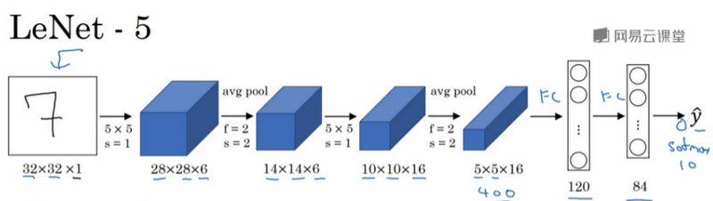

接下来是卷积层，我们用一组16个5×5的过滤器，新的输出结果有16个通道。**LeNet-5**的论文是在1998年撰写的，当时人们并不使用**padding**，或者总是使用**valid**卷积，这就是为什么每进行一次卷积，图像的高度和宽度都会缩小，所以这个图像从14到14缩小到了10×10。然后又是池化层，高度和宽度再缩小一半，输出一个5×5×16的图像。将所有数字相乘，乘积是400。

下一层是全连接层，在全连接层中，有400个节点，每个节点有120个神经元，这里已经有了一个全连接层。但有时还会从这400个节点中抽取一部分节点构建另一个全连接层，就像这样，有2个全连接层。

最后一步就是利用这84个特征得到最后的输出，我们还可以在这里再加一个节点用来预测$\hat{y}$的值，$\hat{y}$有10个可能的值，对应识别0-9这10个数字。在现在的版本中则使用**softmax**函数输出十种分类结果，而在当时，**LeNet-5**网络在输出层使用了另外一种，现在已经很少用到的分类器。

相比现代版本，这里得到的神经网络会小一些，只有约6万个参数。而现在，我们经常看到含有一千万到一亿个参数的神经网络，比这大1000倍的神经网络也不在少数。

不管怎样，如果我们从左往右看，随着网络越来越深，图像的高度和宽度在缩小，从最初的32×32缩小到28×28，再到14×14、10×10，最后只有5×5。与此同时，随着网络层次的加深，通道数量一直在增加，从1增加到6个，再到16个。

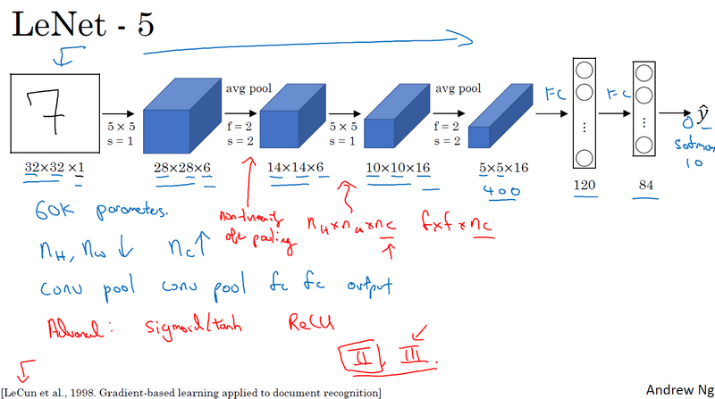

这个神经网络中还有一种模式至今仍然经常用到，就是一个或多个卷积层后面跟着一个池化层，然后又是若干个卷积层再接一个池化层，然后是全连接层，最后是输出，这种排列方式很常用。

对于那些想尝试阅读论文的同学，我再补充几点。接下来的部分主要针对那些打算阅读经典论文的同学，所以会更加深入。这些内容你完全可以跳过，算是对神经网络历史的一种回顾吧，听不懂也不要紧。

读到这篇经典论文时，你会发现，过去，人们使用**sigmod**函数和**tanh**函数，而不是**ReLu**函数，这篇论文中使用的正是**sigmod**函数和**tanh**函数。这种网络结构的特别之处还在于，各网络层之间是有关联的，这在今天看来显得很有趣。

比如说，你有一个$n_{H} \times n_{W} \times n_{C}$的网络，有$n_{C}$个通道，使用尺寸为$f×f×n_{C}$的过滤器，每个过滤器的通道数和它上一层的通道数相同。这是由于在当时，计算机的运行速度非常慢，为了减少计算量和参数，经典的**LeNet-5**网络使用了非常复杂的计算方式，每个过滤器都采用和输入模块一样的通道数量。论文中提到的这些复杂细节，现在一般都不用了。

我认为当时所进行的最后一步其实到现在也还没有真正完成，就是经典的**LeNet-5**网络在池化后进行了非线性函数处理，在这个例子中，池化层之后使用了**sigmod**函数。如果你真的去读这篇论文，这会是最难理解的部分之一，我们会在后面的课程中讲到。

下面要讲的网络结构简单一些，幻灯片的大部分类容来自于原文的第二段和第三段，原文的后几段介绍了另外一种思路。文中提到的这种图形变形网络如今并没有得到广泛应用，所以在读这篇论文的时候，我建议精读第二段，这段重点介绍了这种网络结构。泛读第三段，这里面主要是一些有趣的实验结果。

我要举例说明的第二种神经网络是**AlexNet**，是以论文的第一作者**Alex Krizhevsky**的名字命名的，另外两位合著者是**ilya Sutskever**和**Geoffery Hinton**。

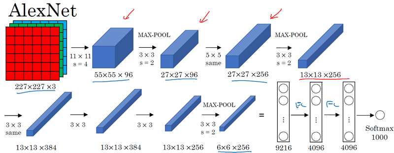

**AlexNet**首先用一张227×227×3的图片作为输入，实际上原文中使用的图像是224×224×3，但是如果你尝试去推导一下，你会发现227×227这个尺寸更好一些。第一层我们使用96个11×11的过滤器，步幅为4，由于步幅是4，因此尺寸缩小到55×55，缩小了4倍左右。然后用一个3×3的过滤器构建最大池化层，$f=3$，步幅$s$为2，卷积层尺寸缩小为27×27×96。接着再执行一个5×5的卷积，**padding**之后，输出是27×27×276。然后再次进行最大池化，尺寸缩小到13×13。再执行一次**same**卷积，相同的**padding**，得到的结果是13×13×384，384个过滤器。再做一次**same**卷积，就像这样。再做一次同样的操作，最后再进行一次最大池化，尺寸缩小到6×6×256。6×6×256等于9216，将其展开为9216个单元，然后是一些全连接层。最后使用**softmax**函数输出识别的结果，看它究竟是1000个可能的对象中的哪一个。

实际上，这种神经网络与**LeNet**有很多相似之处，不过**AlexNet**要大得多。正如前面讲到的**LeNet**或**LeNet-5**大约有6万个参数，而**AlexNet**包含约6000万个参数。当用于训练图像和数据集时，**AlexNet**能够处理非常相似的基本构造模块，这些模块往往包含着大量的隐藏单元或数据，这一点**AlexNet**表现出色。**AlexNet**比**LeNet**表现更为出色的另一个原因是它使用了**ReLu**激活函数。

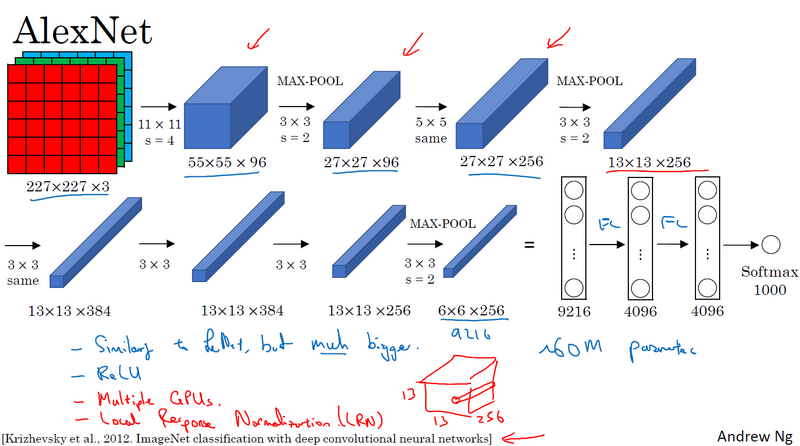

同样的，我还会讲一些比较深奥的内容，如果你并不打算阅读论文，不听也没有关系。第一点，在写这篇论文的时候，**GPU**的处理速度还比较慢，所以**AlexNet**采用了非常复杂的方法在两个**GPU**上进行训练。大致原理是，这些层分别拆分到两个不同的**GPU**上，同时还专门有一个方法用于两个**GPU**进行交流。

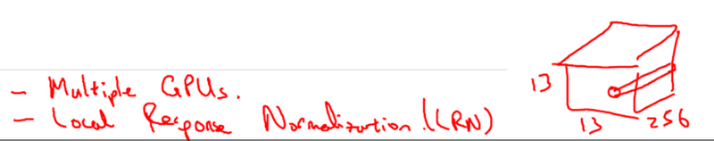

论文还提到，经典的**AlexNet**结构还有另一种类型的层，叫作“局部响应归一化层”（**Local Response Normalization**），即**LRN**层，这类层应用得并不多，所以我并没有专门讲。局部响应归一层的基本思路是，假如这是网络的一块，比如是13×13×256，**LRN**要做的就是选取一个位置，比如说这样一个位置，从这个位置穿过整个通道，能得到256个数字，并进行归一化。进行局部响应归一化的动机是，对于这张13×13的图像中的每个位置来说，我们可能并不需要太多的高激活神经元。但是后来，很多研究者发现**LRN**起不到太大作用，这应该是被我划掉的内容之一，因为并不重要，而且我们现在并不用**LRN**来训练网络。

如果你对深度学习的历史感兴趣的话，我认为在**AlexNet**之前，深度学习已经在语音识别和其它几个领域获得了一些关注，但正是通过这篇论文，计算机视觉群体开始重视深度学习，并确信深度学习可以应用于计算机视觉领域。此后，深度学习在计算机视觉及其它领域的影响力与日俱增。如果你并不打算阅读这方面的论文，其实可以不用学习这节课。但如果你想读懂一些相关的论文，这是比较好理解的一篇，学起来会容易一些。

**AlexNet**网络结构看起来相对复杂，包含大量超参数，这些数字（55×55×96、27×27×96、27×27×256……）都是**Alex Krizhevsky**及其合著者不得不给出的。

这节课要讲的第三个，也是最后一个范例是**VGG**，也叫作**VGG-16**网络。值得注意的一点是，**VGG-16**网络没有那么多超参数，这是一种只需要专注于构建卷积层的简单网络。首先用3×3，步幅为1的过滤器构建卷积层，**padding**参数为**same**卷积中的参数。然后用一个2×2，步幅为2的过滤器构建最大池化层。因此**VGG**网络的一大优点是它确实简化了神经网络结构，下面我们具体讲讲这种网络结构。

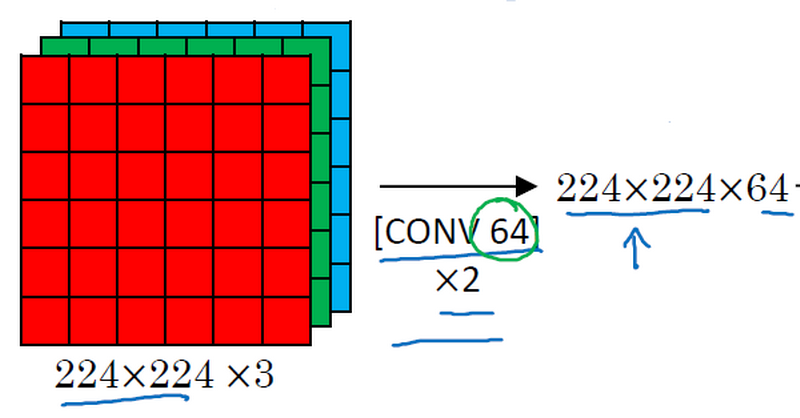

假设要识别这个图像，在最开始的两层用64个3×3的过滤器对输入图像进行卷积，输出结果是224×224×64，因为使用了**same**卷积，通道数量也一样。**VGG-16**其实是一个很深的网络，这里我并没有把所有卷积层都画出来。

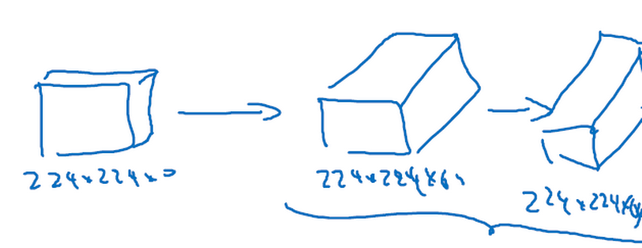

假设这个小图是我们的输入图像，尺寸是224×224×3，进行第一个卷积之后得到224×224×64的特征图，接着还有一层224×224×64，得到这样2个厚度为64的卷积层，意味着我们用64个过滤器进行了两次卷积。正如我在前面提到的，这里采用的都是大小为3×3，步幅为1的过滤器，并且都是采用**same**卷积，所以我就不再把所有的层都画出来了，只用一串数字代表这些网络。

接下来创建一个池化层，池化层将输入图像进行压缩，从224×224×64缩小到多少呢？没错，减少到112×112×64。然后又是若干个卷积层，使用129个过滤器，以及一些**same**卷积，我们看看输出什么结果，112×112×128.然后进行池化，可以推导出池化后的结果是这样（56×56×128）。接着再用256个相同的过滤器进行三次卷积操作，然后再池化，然后再卷积三次，再池化。如此进行几轮操作后，将最后得到的7×7×512的特征图进行全连接操作，得到4096个单元，然后进行**softmax**激活，输出从1000个对象中识别的结果。

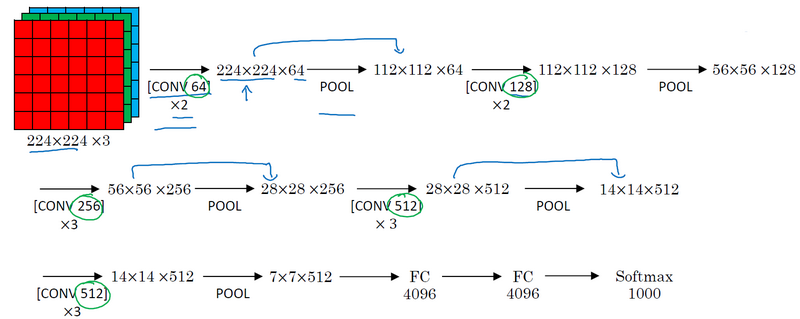

顺便说一下，**VGG-16**的这个数字16，就是指在这个网络中包含16个卷积层和全连接层。确实是个很大的网络，总共包含约1.38亿个参数，即便以现在的标准来看都算是非常大的网络。但**VGG-16**的结构并不复杂，这点非常吸引人，而且这种网络结构很规整，都是几个卷积层后面跟着可以压缩图像大小的池化层，池化层缩小图像的高度和宽度。同时，卷积层的过滤器数量变化存在一定的规律，由64翻倍变成128，再到256和512。作者可能认为512已经足够大了，所以后面的层就不再翻倍了。无论如何，每一步都进行翻倍，或者说在每一组卷积层进行过滤器翻倍操作，正是设计此种网络结构的另一个简单原则。这种相对一致的网络结构对研究者很有吸引力，而它的主要缺点是需要训练的特征数量非常巨大。

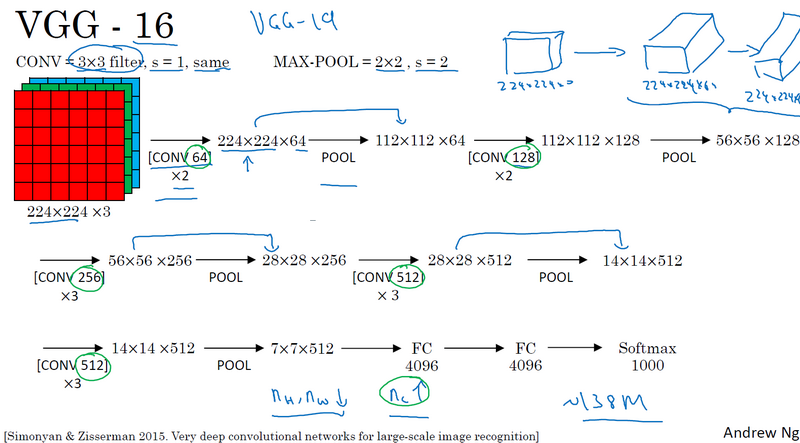

有些文章还介绍了**VGG-19**网络，它甚至比**VGG-16**还要大，如果你想了解更多细节，请参考幻灯片下方的注文，阅读由**Karen Simonyan**和**Andrew Zisserman**撰写的论文。由于**VGG-16**的表现几乎和**VGG-19**不分高下，所以很多人还是会使用**VGG-16**。我最喜欢它的一点是，文中揭示了，随着网络的加深，图像的高度和宽度都在以一定的规律不断缩小，每次池化后刚好缩小一半，而通道数量在不断增加，而且刚好也是在每组卷积操作后增加一倍。也就是说，图像缩小的比例和通道数增加的比例是有规律的。从这个角度来看，这篇论文很吸引人。

以上就是三种经典的网络结构，如果你对这些论文感兴趣，我建议从介绍**AlexNet**的论文开始，然后就是**VGG**的论文，最后是**LeNet**的论文。虽然有些晦涩难懂，但对于了解这些网络结构很有帮助。

学过这些经典的网络之后，下节课我们会学习一些更先高级更强大的神经网络结构，下节课见。

### 2.3 残差网络(ResNets)（Residual Networks (ResNets)）

非常非常深的神经网络是很难训练的，因为存在梯度消失和梯度爆炸问题。这节课我们学习跳跃连接（**Skip connection**），它可以从某一层网络层获取激活，然后迅速反馈给另外一层，甚至是神经网络的更深层。我们可以利用跳跃连接构建能够训练深度网络的**ResNets**，有时深度能够超过100层，让我们开始吧。

**ResNets**是由残差块（**Residual block**）构建的，首先我解释一下什么是残差块。

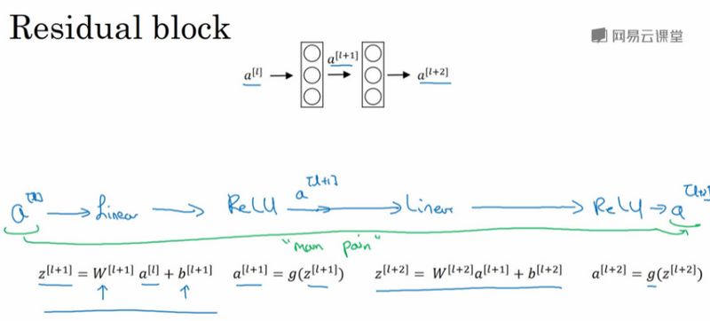

这是一个两层神经网络，在$L$层进行激活，得到$a^{\left\lbrack l + 1 \right\rbrack}$，再次进行激活，两层之后得到$a^{\left\lbrack l + 2 \right\rbrack}$。计算过程是从$a^{[l]}$开始，首先进行线性激活，根据这个公式：$z^{\left\lbrack l + 1 \right\rbrack} = W^{\left\lbrack l + 1 \right\rbrack}a^{[l]} + b^{\left\lbrack l + 1 \right\rbrack}$，通过$a^{[l]}$算出$z^{\left\lbrack l + 1 \right\rbrack}$，即$a^{[l]}$乘以权重矩阵，再加上偏差因子。然后通过**ReLU**非线性激活函数得到$a^{\left\lbrack l + 1 \right\rbrack}$，$a^{\left\lbrack l + 1 \right\rbrack} =g(z^{\left\lbrack l + 1 \right\rbrack})$计算得出。接着再次进行线性激活，依据等式$z^{\left\lbrack l + 2 \right\rbrack} = W^{\left\lbrack 2 + 1 \right\rbrack}a^{\left\lbrack l + 1 \right\rbrack} + b^{\left\lbrack l + 2 \right\rbrack}$，最后根据这个等式再次进行**ReLu**非线性激活，即$a^{\left\lbrack l + 2 \right\rbrack} = g(z^{\left\lbrack l + 2   \right\rbrack})$，这里的$g$是指**ReLU**非线性函数，得到的结果就是$a^{\left\lbrack l + 2 \right\rbrack}$。换句话说，信息流从$a^{\left\lbrack l   \right\rbrack}$到$a^{\left\lbrack l + 2  \right\rbrack}$需要经过以上所有步骤，即这组网络层的主路径。

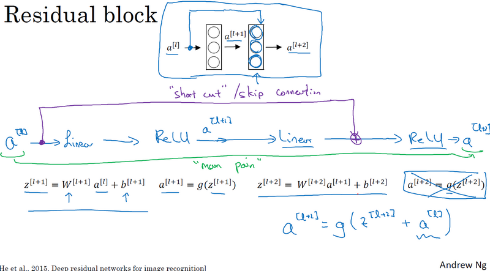

在残差网络中有一点变化，我们将$a^{[l]}$直接向后，拷贝到神经网络的深层，在**ReLU**非线性激活函数前加上$a^{[l]}$，这是一条捷径。$a^{[l]}$的信息直接到达神经网络的深层，不再沿着主路径传递，这就意味着最后这个等式($a^{\left\lbrack l + 2 \right\rbrack} = g(z^{\left\lbrack l + 2 \right\rbrack})$)去掉了，取而代之的是另一个**ReLU**非线性函数，仍然对$z^{\left\lbrack l + 2 \right\rbrack}$进行$g$函数处理，但这次要加上$a^{[l]}$，即：$\ a^{\left\lbrack l + 2 \right\rbrack} = g\left(z^{\left\lbrack l + 2 \right\rbrack} + a^{[l]}\right)$，也就是加上的这个$a^{[l]}$产生了一个残差块。

在上面这个图中，我们也可以画一条捷径，直达第二层。实际上这条捷径是在进行**ReLU**非线性激活函数之前加上的，而这里的每一个节点都执行了线性函数和**ReLU**激活函数。所以$a^{[l]}$插入的时机是在线性激活之后，**ReLU**激活之前。除了捷径，你还会听到另一个术语“跳跃连接”，就是指$a^{[l]}$跳过一层或者好几层，从而将信息传递到神经网络的更深层。

**ResNet**的发明者是**何凯明**（**Kaiming He**）、**张翔宇**（**Xiangyu Zhang**）、**任少卿**（**Shaoqing Ren**）和**孙剑**（**Jiangxi Sun**），他们发现使用残差块能够训练更深的神经网络。所以构建一个**ResNet**网络就是通过将很多这样的残差块堆积在一起，形成一个很深神经网络，我们来看看这个网络。

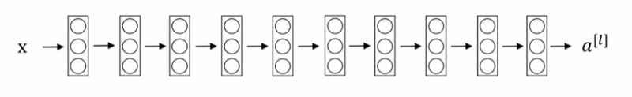

这并不是一个残差网络，而是一个普通网络（**Plain network**），这个术语来自**ResNet**论文。

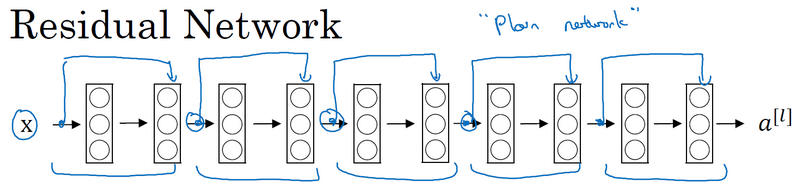

把它变成**ResNet**的方法是加上所有跳跃连接，正如前一张幻灯片中看到的，每两层增加一个捷径，构成一个残差块。如图所示，5个残差块连接在一起构成一个残差网络。

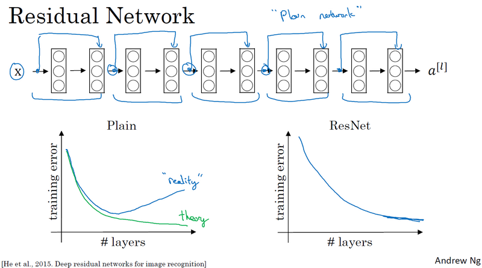

如果我们使用标准优化算法训练一个普通网络，比如说梯度下降法，或者其它热门的优化算法。如果没有残差，没有这些捷径或者跳跃连接，凭经验你会发现随着网络深度的加深，训练错误会先减少，然后增多。而理论上，随着网络深度的加深，应该训练得越来越好才对。也就是说，理论上网络深度越深越好。但实际上，如果没有残差网络，对于一个普通网络来说，深度越深意味着用优化算法越难训练。实际上，随着网络深度的加深，训练错误会越来越多。

但有了**ResNets**就不一样了，即使网络再深，训练的表现却不错，比如说训练误差减少，就算是训练深达100层的网络也不例外。有人甚至在1000多层的神经网络中做过实验，尽管目前我还没有看到太多实际应用。但是对$x$的激活，或者这些中间的激活能够到达网络的更深层。这种方式确实有助于解决梯度消失和梯度爆炸问题，让我们在训练更深网络的同时，又能保证良好的性能。也许从另外一个角度来看，随着网络越来深，网络连接会变得臃肿，但是**ResNet**确实在训练深度网络方面非常有效。

现在大家对**ResNet**已经有了一个大致的了解，通过本周的编程练习，你可以尝试亲自实现一下这些想法。至于为什么**ResNets**能有如此好的表现，接下来我会有更多更棒的内容分享给大家，我们下个视频见。

### 2.4 残差网络为什么有用？（Why ResNets work?）

为什么**ResNets**能有如此好的表现，我们来看个例子，它解释了其中的原因，至少可以说明，如何构建更深层次的**ResNets**网络的同时还不降低它们在训练集上的效率。希望你已经通过第三门课了解到，通常来讲，网络在训练集上表现好，才能在**Hold-Out**交叉验证集或**dev**集和测试集上有好的表现，所以至少在训练集上训练好**ResNets**是第一步。

先来看个例子，上节课我们了解到，一个网络深度越深，它在训练集上训练的效率就会有所减弱，这也是有时候我们不希望加深网络的原因。而事实并非如此，至少在训练**ResNets**网络时，并非完全如此，举个例子。

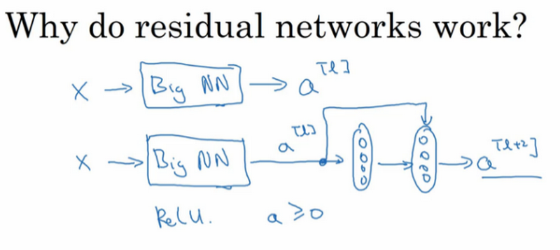

假设有一个大型神经网络，其输入为$X$，输出激活值$a^{[l]}$。假如你想增加这个神经网络的深度，那么用**Big NN**表示，输出为$ a^{\left\lbrack l\right\rbrack}$。再给这个网络额外添加两层，依次添加两层，最后输出为$a^{\left\lbrack l + 2 \right\rbrack}$，可以把这两层看作一个**ResNets**块，即具有捷径连接的残差块。为了方便说明，假设我们在整个网络中使用**ReLU**激活函数，所以激活值都大于等于0，包括输入$X$的非零异常值。因为**ReLU**激活函数输出的数字要么是0，要么是正数。

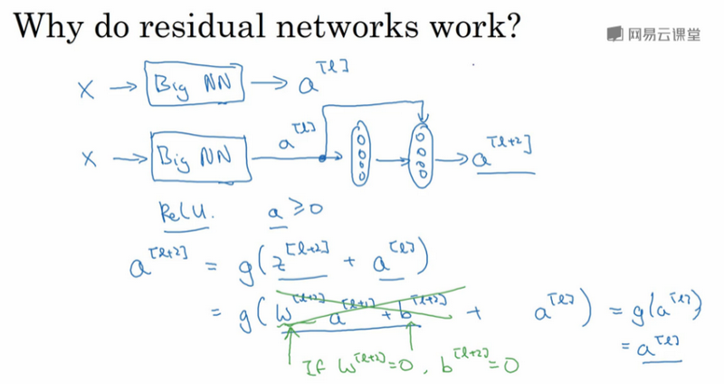

我们看一下$a^{\left\lbrack l + 2\right\rbrack}$的值，也就是上节课讲过的表达式，即$a^{\left\lbrack l + 2\right\rbrack} = g(z^{\left\lbrack l + 2 \right\rbrack} + a^{\left\lbrack l\right\rbrack})$，添加项$a^{\left\lbrack l\right\rbrack}$是刚添加的跳跃连接的输入。展开这个表达式$a^{\left\lbrack l + 2 \right\rbrack} = g(W^{\left\lbrack l + 2 \right\rbrack}a^{\left\lbrack l + 1 \right\rbrack} + b^{\left\lbrack l + 2 \right\rbrack} + a^{\left\lbrack l\right\rbrack})$，其中$z^{\left\lbrack l + 2 \right\rbrack} = W^{\left\lbrack l + 2 \right\rbrack}a^{\left\lbrack l + 1 \right\rbrack} + b^{\left\lbrack l + 2\right\rbrack}$。注意一点，如果使用**L2**正则化或权重衰减，它会压缩$W^{\left\lbrack l + 2\right\rbrack}$的值。如果对$b$应用权重衰减也可达到同样的效果，尽管实际应用中，你有时会对$b$应用权重衰减，有时不会。这里的$W$是关键项，如果$W^{\left\lbrack l + 2 \right\rbrack} = 0$，为方便起见，假设$b^{\left\lbrack l + 2 \right\rbrack} = 0$，这几项就没有了，因为它们（$W^{\left\lbrack l + 2 \right\rbrack}a^{\left\lbrack l + 1 \right\rbrack} + b^{\left\lbrack l + 2\right\rbrack}$）的值为0。最后$ a^{\left\lbrack l + 2 \right\rbrack} = \ g\left( a^{[l]} \right) = a^{\left\lbrack l\right\rbrack}$，因为我们假定使用**ReLU**激活函数，并且所有激活值都是非负的，$g\left(a^{[l]} \right)$是应用于非负数的**ReLU**函数，所以$a^{[l+2]} =a^{[l]}$。

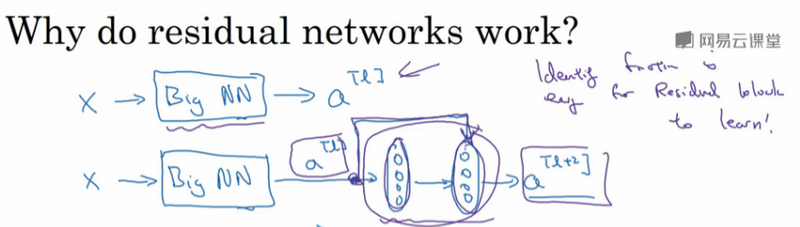

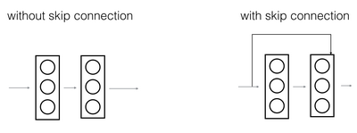

结果表明，残差块学习这个恒等式函数并不难，跳跃连接使我们很容易得出$ a^{\left\lbrack l + 2 \right\rbrack} = a^{\left\lbrack l\right\rbrack}$。这意味着，即使给神经网络增加了这两层，它的效率也并不逊色于更简单的神经网络，因为学习恒等函数对它来说很简单。尽管它多了两层，也只把$a^{[l]}$的值赋值给$a^{\left\lbrack l + 2 \right\rbrack}$。所以给大型神经网络增加两层，不论是把残差块添加到神经网络的中间还是末端位置，都不会影响网络的表现。

当然，我们的目标不仅仅是保持网络的效率，还要提升它的效率。想象一下，如果这些隐藏层单元学到一些有用信息，那么它可能比学习恒等函数表现得更好。而这些不含有残差块或跳跃连接的深度普通网络情况就不一样了，当网络不断加深时，就算是选用学习恒等函数的参数都很困难，所以很多层最后的表现不但没有更好，反而更糟。

我认为残差网络起作用的主要原因就是这些残差块学习恒等函数非常容易，你能确定网络性能不会受到影响，很多时候甚至可以提高效率，或者说至少不会降低网络的效率，因此创建类似残差网络可以提升网络性能。

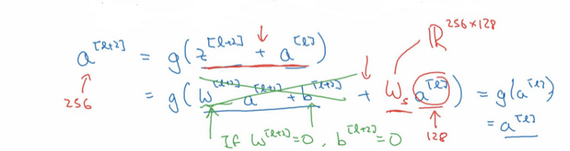

除此之外，关于残差网络，另一个值得探讨的细节是，假设$ z^{\left\lbrack l + 2\right\rbrack}$与$a^{[l]}$具有相同维度，所以**ResNets**使用了许多**same**卷积，所以这个$a^{\left\lbrack l\right\rbrack}$的维度等于这个输出层的维度。之所以能实现跳跃连接是因为**same**卷积保留了维度，所以很容易得出这个捷径连接，并输出这两个相同维度的向量。

如果输入和输出有不同维度，比如输入的维度是128，$ a^{\left\lbrack l + 2\right\rbrack}$的维度是256，再增加一个矩阵，这里标记为$W_{s}$，$W_{s}$是一个256×128维度的矩阵，所以$W_{s}a^{\left\lbrack l\right\rbrack}$的维度是256，这个新增项是256维度的向量。你不需要对$W_{s}$做任何操作，它是网络通过学习得到的矩阵或参数，它是一个固定矩阵，**padding**值为0，用0填充$a^{[l]}$，其维度为256，所以者几个表达式都可以。

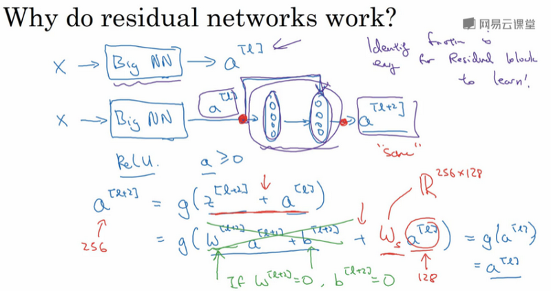

最后，我们来看看**ResNets**的图片识别。这些图片是我从何凯明等人论文中截取的，这是一个普通网络，我们给它输入一张图片，它有多个卷积层，最后输出了一个**Softmax**。

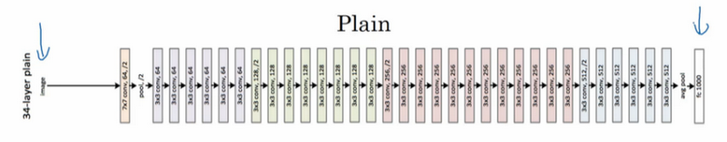

如何把它转化为**ResNets**呢？只需要添加跳跃连接。这里我们只讨论几个细节，这个网络有很多层3×3卷积，而且它们大多都是**same**卷积，这就是添加等维特征向量的原因。所以这些都是卷积层，而不是全连接层，因为它们是**same**卷积，维度得以保留，这也解释了添加项$ z^{\left\lbrack l + 2 \right\rbrack} + a^{\left\lbrack l\right\rbrack}$（维度相同所以能够相加）。

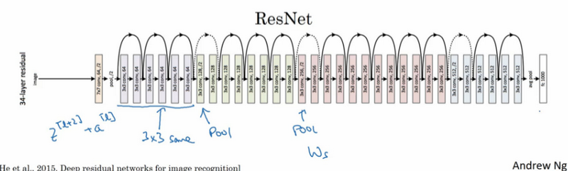

**ResNets**类似于其它很多网络，也会有很多卷积层，其中偶尔会有池化层或类池化层的层。不论这些层是什么类型，正如我们在上一张幻灯片看到的，你都需要调整矩阵$W_{s}$的维度。普通网络和**ResNets**网络常用的结构是：卷积层-卷积层-卷积层-池化层-卷积层-卷积层-卷积层-池化层……依此重复。直到最后，有一个通过**softmax**进行预测的全连接层。

以上就是**ResNets**的内容。使用1×1的过滤器，即1×1卷积，这个想法很有意思，为什么呢？我们下节课再讲。

### 2.5 网络中的网络以及 1×1 卷积（Network in Network and 1×1 convolutions）

在架构内容设计方面，其中一个比较有帮助的想法是使用1×1卷积。也许你会好奇，1×1的卷积能做什么呢？不就是乘以数字么？听上去挺好笑的，结果并非如此，我们来具体看看。

过滤器为1×1，这里是数字2，输入一张6×6×1的图片，然后对它做卷积，起过滤器大小为1×1×1，结果相当于把这个图片乘以数字2，所以前三个单元格分别是2、4、6等等。用1×1的过滤器进行卷积，似乎用处不大，只是对输入矩阵乘以某个数字。但这仅仅是对于6×6×1的一个通道图片来说，1×1卷积效果不佳。

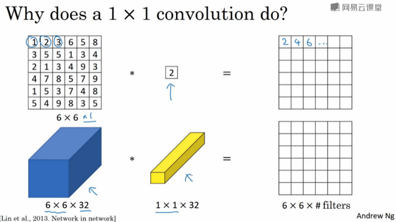

如果是一张6×6×32的图片，那么使用1×1过滤器进行卷积效果更好。具体来说，1×1卷积所实现的功能是遍历这36个单元格，计算左图中32个数字和过滤器中32个数字的元素积之和，然后应用**ReLU**非线性函数。

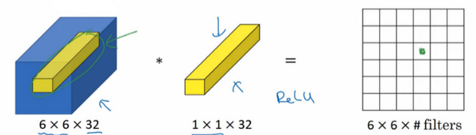

我们以其中一个单元为例，它是这个输入层上的某个切片，用这36个数字乘以这个输入层上1×1切片，得到一个实数，像这样把它画在输出中。

这个1×1×32过滤器中的32个数字可以这样理解，一个神经元的输入是32个数字（输入图片中左下角位置32个通道中的数字），即相同高度和宽度上某一切片上的32个数字，这32个数字具有不同通道，乘以32个权重（将过滤器中的32个数理解为权重），然后应用**ReLU**非线性函数，在这里输出相应的结果。

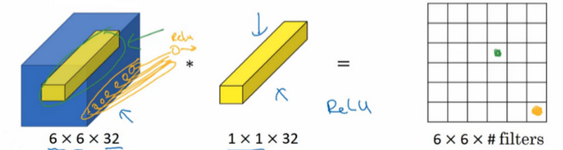

一般来说，如果过滤器不止一个，而是多个，就好像有多个输入单元，其输入内容为一个切片上所有数字，输出结果是6×6过滤器数量。

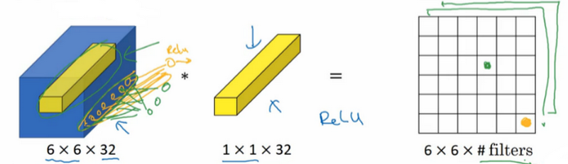

所以1×1卷积可以从根本上理解为对这32个不同的位置都应用一个全连接层，全连接层的作用是输入32个数字（过滤器数量标记为$n_{C}^{\left\lbrack l + 1\right\rbrack}$，在这36个单元上重复此过程）,输出结果是6×6×\#filters（过滤器数量），以便在输入层上实施一个非平凡（**non-trivial**）计算。

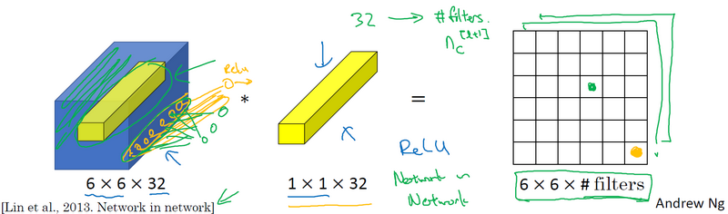

这种方法通常称为1×1卷积，有时也被称为**Network in Network**，在林敏、陈强和杨学成的论文中有详细描述。虽然论文中关于架构的详细内容并没有得到广泛应用，但是1×1卷积或**Network in Network**这种理念却很有影响力，很多神经网络架构都受到它的影响，包括下节课要讲的**Inception**网络。

举个1×1卷积的例子，相信对大家有所帮助，这是它的一个应用。

假设这是一个28×28×192的输入层，你可以使用池化层压缩它的高度和宽度，这个过程我们很清楚。但如果通道数量很大，该如何把它压缩为28×28×32维度的层呢？你可以用32个大小为1×1的过滤器，严格来讲每个过滤器大小都是1×1×192维，因为过滤器中通道数量必须与输入层中通道的数量保持一致。但是你使用了32个过滤器，输出层为28×28×32，这就是压缩通道数（$n_{c}$）的方法，对于池化层我只是压缩了这些层的高度和宽度。

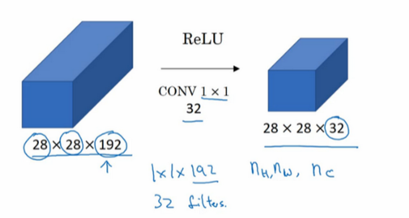

在之后我们看到在某些网络中1×1卷积是如何压缩通道数量并减少计算的。当然如果你想保持通道数192不变，这也是可行的，1×1卷积只是添加了非线性函数，当然也可以让网络学习更复杂的函数，比如，我们再添加一层，其输入为28×28×192，输出为28×28×192。

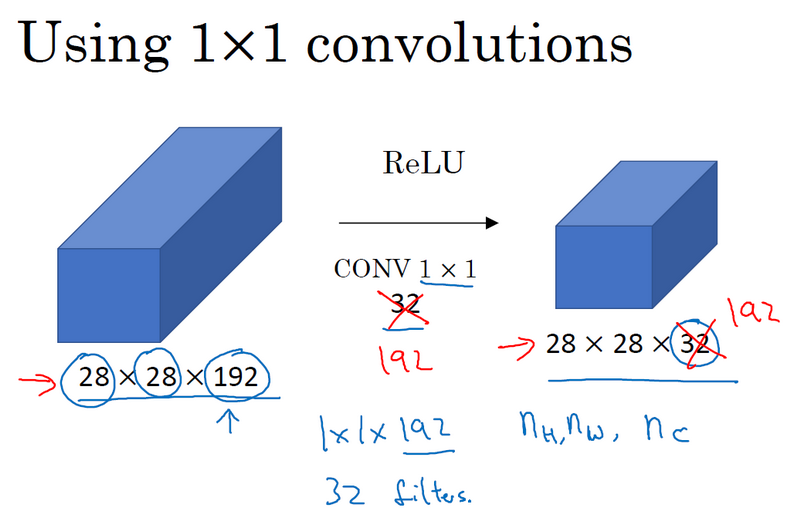

1×1卷积层就是这样实现了一些重要功能的（**doing something pretty non-trivial**），它给神经网络添加了一个非线性函数，从而减少或保持输入层中的通道数量不变，当然如果你愿意，也可以增加通道数量。后面你会发现这对构建**Inception**网络很有帮助，我们放在下节课讲。

这节课我们演示了如何根据自己的意愿通过1×1卷积的简单操作来压缩或保持输入层中的通道数量，甚至是增加通道数量。下节课，我们再讲讲1×1卷积是如何帮助我们构建**Inception**网络的，下节课见。

### 2.6 谷歌 Inception 网络简介（Inception network motivation）

构建卷积层时，你要决定过滤器的大小究竟是1×1（原来是1×3，猜测为口误），3×3还是5×5，或者要不要添加池化层。而**Inception**网络的作用就是代替你来决定，虽然网络架构因此变得更加复杂，但网络表现却非常好，我们来了解一下其中的原理。

例如，这是你28×28×192维度的输入层，**Inception**网络或**Inception**层的作用就是代替人工来确定卷积层中的过滤器类型，或者确定是否需要创建卷积层或池化层，我们演示一下。

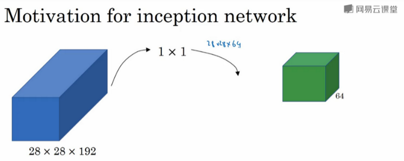

如果使用1×1卷积，输出结果会是28×28×\#（某个值），假设输出为28×28×64，并且这里只有一个层。

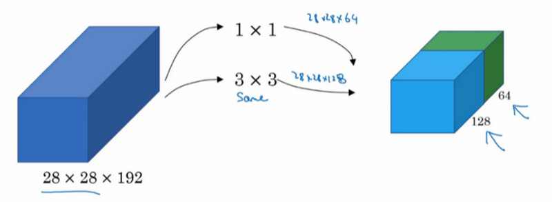

如果使用3×3的过滤器，那么输出是28×28×128。然后我们把第二个值堆积到第一个值上，为了匹配维度，我们应用**same**卷积，输出维度依然是28×28，和输入维度相同，即高度和宽度相同。

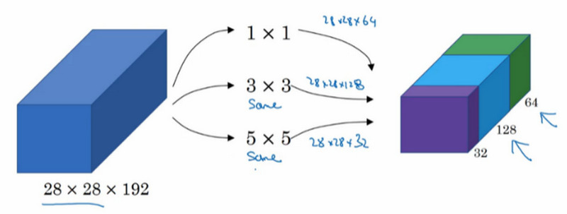

或许你会说，我希望提升网络的表现，用5×5过滤器或许会更好，我们不妨试一下，输出变成28×28×32，我们再次使用**same**卷积，保持维度不变。

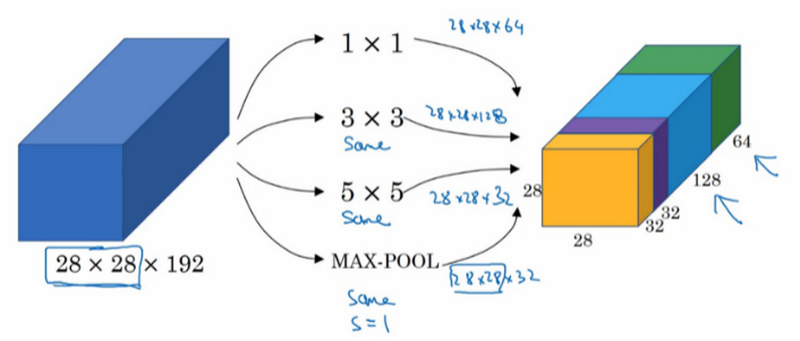

或许你不想要卷积层，那就用池化操作，得到一些不同的输出结果，我们把它也堆积起来，这里的池化输出是28×28×32。为了匹配所有维度，我们需要对最大池化使用**padding**，它是一种特殊的池化形式，因为如果输入的高度和宽度为28×28，则输出的相应维度也是28×28。然后再进行池化，**padding**不变，步幅为1。

这个操作非常有意思，但我们要继续学习后面的内容，一会再实现这个池化过程。

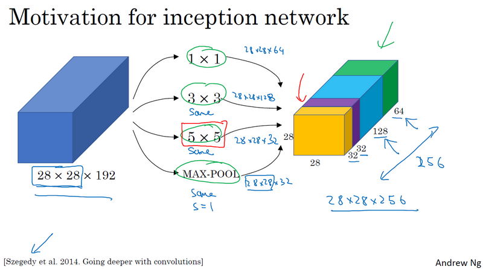

有了这样的**Inception**模块，你就可以输入某个量，因为它累加了所有数字，这里的最终输出为32+32+128+64=256。**Inception**模块的输入为28×28×192，输出为28×28×256。这就是**Inception**网络的核心内容，提出者包括**Christian Szegedy、刘伟、贾阳青、Pierre Sermanet、Scott Reed、Dragomir Anguelov、Dumitru Erhan、Vincent Vanhoucke**和**Andrew Rabinovich**。基本思想是**Inception**网络不需要人为决定使用哪个过滤器或者是否需要池化，而是由网络自行确定这些参数，你可以给网络添加这些参数的所有可能值，然后把这些输出连接起来，让网络自己学习它需要什么样的参数，采用哪些过滤器组合。

不难发现，我所描述的**Inception**层有一个问题，就是计算成本，下一张幻灯片，我们就来计算这个5×5过滤器在该模块中的计算成本。

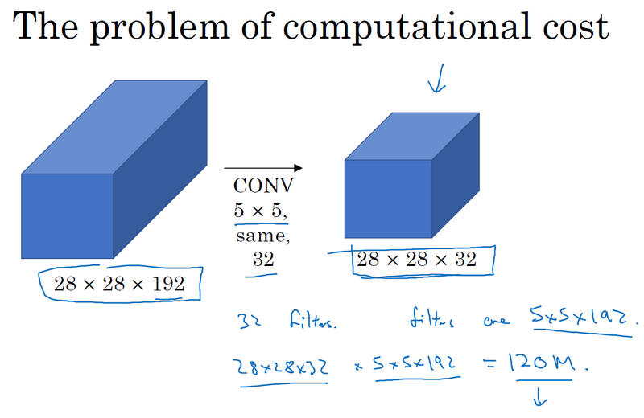

我们把重点集中在前一张幻灯片中的5×5的过滤器，这是一个28×28×192的输入块，执行一个5×5卷积，它有32个过滤器，输出为28×28×32。前一张幻灯片中，我用一个紫色的细长块表示，这里我用一个看起来更普通的蓝色块表示。我们来计算这个28×28×32输出的计算成本，它有32个过滤器，因为输出有32个通道，每个过滤器大小为5×5×192，输出大小为28×28×32，所以你要计算28×28×32个数字。对于输出中的每个数字来说，你都需要执行5×5×192次乘法运算，所以乘法运算的总次数为每个输出值所需要执行的乘法运算次数（5×5×192）乘以输出值个数（28×28×32），把这些数相乘结果等于1.2亿(120422400)。即使在现在，用计算机执行1.2亿次乘法运算，成本也是相当高的。下一张幻灯片会介绍1×1卷积的应用，也就是我们上节课所学的。为了降低计算成本，我们用计算成本除以因子10，结果它从1.2亿减小到原来的十分之一。请记住120这个数字，一会还要和下一页看到的数字做对比。

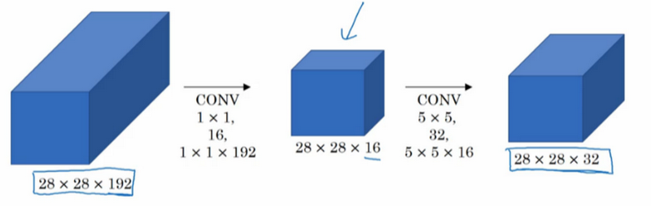

这里还有另外一种架构，其输入为28×28×192，输出为28×28×32。其结果是这样的，对于输入层，使用1×1卷积把输入值从192个通道减少到16个通道。然后对这个较小层运行5×5卷积，得到最终输出。请注意，输入和输出的维度依然相同，输入是28×28×192，输出是28×28×32，和上一页的相同。但我们要做的就是把左边这个大的输入层压缩成这个较小的的中间层，它只有16个通道，而不是192个。

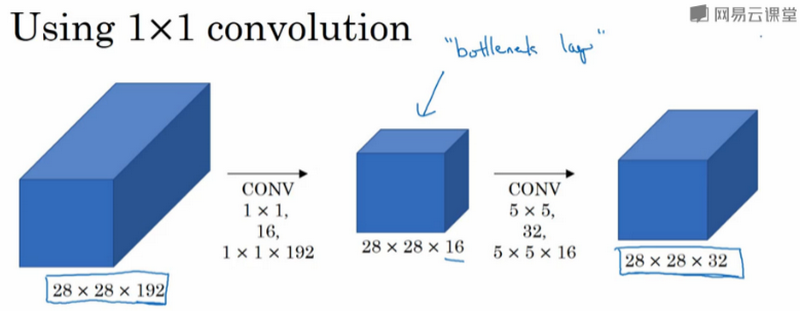

有时候这被称为瓶颈层，瓶颈通常是某个对象最小的部分，假如你有这样一个玻璃瓶，这是瓶塞位置，瓶颈就是这个瓶子最小的部分。

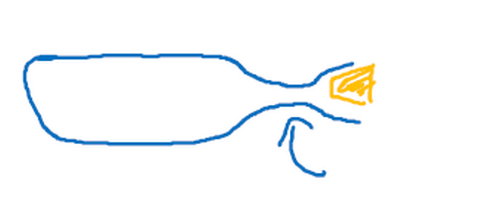

同理，瓶颈层也是网络中最小的部分，我们先缩小网络表示，然后再扩大它。

接下来我们看看这个计算成本，应用1×1卷积，过滤器个数为16，每个过滤器大小为1×1×192，这两个维度相匹配（输入通道数与过滤器通道数），28×28×16这个层的计算成本是，输出28×28×192中每个元素都做192次乘法，用1×1×192来表示，相乘结果约等于240万。

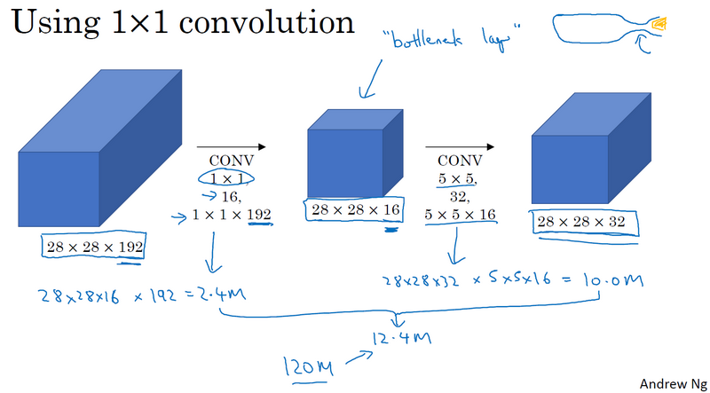

那第二个卷积层呢？240万只是第一个卷积层的计算成本，第二个卷积层的计算成本又是多少呢？这是它的输出，28×28×32，对每个输出值应用一个5×5×16维度的过滤器，计算结果为1000万。

所以所需要乘法运算的总次数是这两层的计算成本之和，也就是1204万，与上一张幻灯片中的值做比较，计算成本从1.2亿下降到了原来的十分之一，即1204万。所需要的加法运算与乘法运算的次数近似相等，所以我只统计了乘法运算的次数。

总结一下，如果你在构建神经网络层的时候，不想决定池化层是使用1×1，3×3还是5×5的过滤器，那么**Inception**模块就是最好的选择。我们可以应用各种类型的过滤器，只需要把输出连接起来。之后我们讲到计算成本问题，我们学习了如何通过使用1×1卷积来构建瓶颈层，从而大大降低计算成本。

你可能会问，仅仅大幅缩小表示层规模会不会影响神经网络的性能？事实证明，只要合理构建瓶颈层，你既可以显著缩小表示层规模，又不会降低网络性能，从而节省了计算。

这就是**Inception**模块的主要思想，我们在这总结一下。下节课，我们将演示一个完整的**Inception**网络。

### 2.7 Inception 网络（Inception network）

在上节视频中，你已经见到了所有的**Inception**网络基础模块。在本视频中，我们将学习如何将这些模块组合起来，构筑你自己的**Inception**网络。

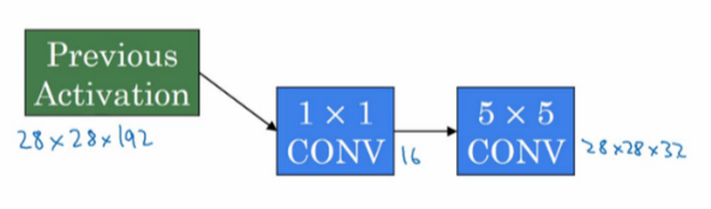

**Inception**模块会将之前层的激活或者输出作为它的输入，作为前提，这是一个28×28×192的输入，和我们之前视频中的一样。我们详细分析过的例子是，先通过一个1×1的层，再通过一个5×5的层，1×1的层可能有16个通道，而5×5的层输出为28×28×32，共32个通道，这就是上个视频最后讲到的我们处理的例子。

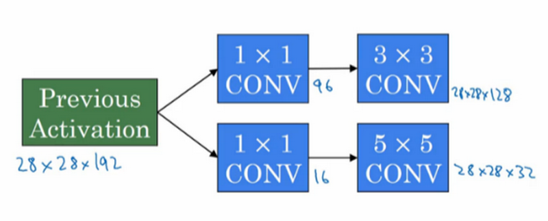

为了在这个3×3的卷积层中节省运算量，你也可以做相同的操作，这样的话3×3的层将会输出28×28×128。

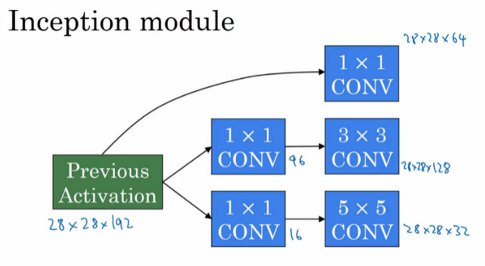

或许你还想将其直接通过一个1×1的卷积层，这时就不必在后面再跟一个1×1的层了，这样的话过程就只有一步，假设这个层的输出是28×28×64。

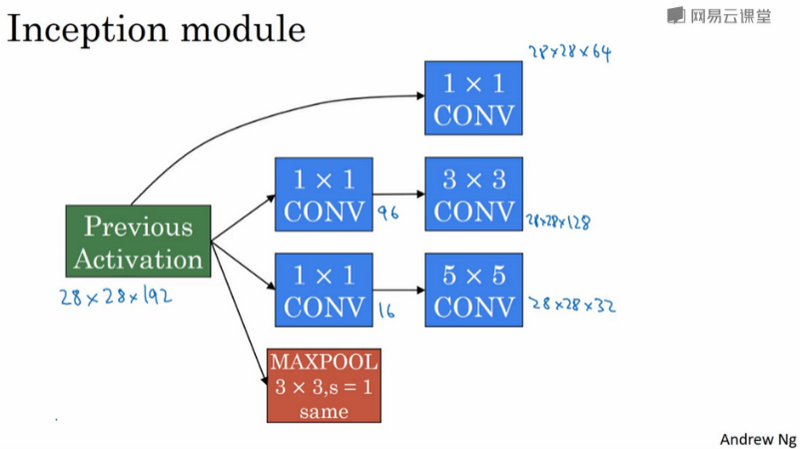

最后是池化层。

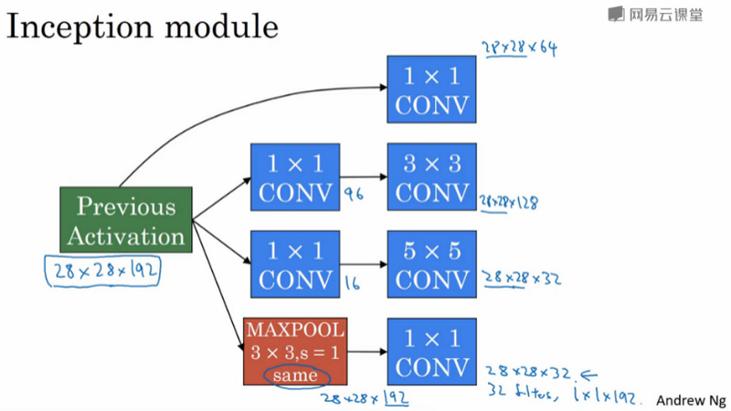

这里我们要做些有趣的事情，为了能在最后将这些输出都连接起来，我们会使用**same**类型的**padding**来池化，使得输出的高和宽依然是28×28，这样才能将它与其他输出连接起来。但注意，如果你进行了最大池化，即便用了**same padding**，3×3的过滤器，**stride**为1，其输出将会是28×28×192，其通道数或者说深度与这里的输入（通道数）相同。所以看起来它会有很多通道，我们实际要做的就是再加上一个1×1的卷积层，去进行我们在1×1卷积层的视频里所介绍的操作，将通道的数量缩小，缩小到28×28×32。也就是使用32个维度为1×1×192的过滤器，所以输出的维度其通道数缩小为32。这样就避免了最后输出时，池化层占据所有的通道。

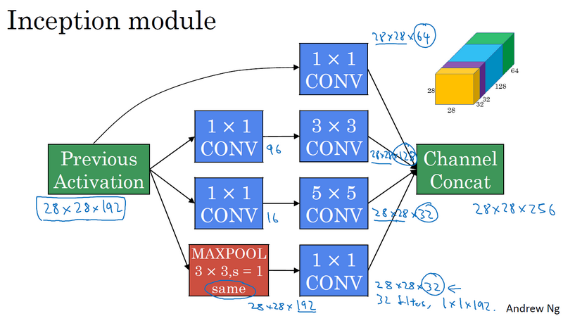

最后，将这些方块全都连接起来。在这过程中，把得到的各个层的通道都加起来，最后得到一个28×28×256的输出。通道连接实际就是之前视频中看到过的，把所有方块连接在一起的操作。这就是一个**Inception**模块，而**Inception**网络所做的就是将这些模块都组合到一起。

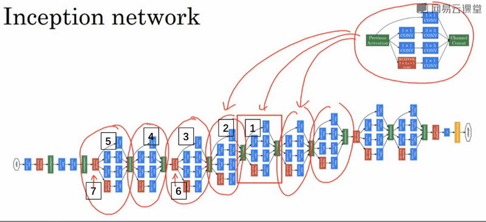

这是一张取自**Szegety et al**的论文中关于**Inception**网络的图片，你会发现图中有许多重复的模块，可能整张图看上去很复杂，但如果你只截取其中一个环节（编号1），就会发现这是在前一页**ppt**中所见的**Inception**模块。

我们深入看看里边的一些细节，这是另一个**Inception**模块（编号2），这也是一个**Inception**模块（编号3）。这里有一些额外的最大池化层（编号6）来修改高和宽的维度。这是另外一个**Inception**模块（编号4），这是另外一个最大池化层（编号7），它改变了高和宽。而这里又是另一个**Inception**模块（编号5）。

所以**Inception**网络只是很多这些你学过的模块在不同的位置重复组成的网络，所以如果你理解了之前所学的**Inception**模块，你就也能理解**Inception**网络。

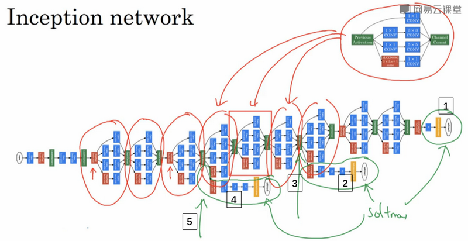

事实上，如果你读过论文的原文，你就会发现，这里其实还有一些分支，我现在把它们加上去。所以这些分支有什么用呢？在网络的最后几层，通常称为全连接层，在它之后是一个**softmax**层（编号1）来做出预测，这些分支（编号2）所做的就是通过隐藏层（编号3）来做出预测，所以这其实是一个**softmax**输出（编号2），这（编号1）也是。这是另一条分支（编号4），它也包含了一个隐藏层，通过一些全连接层，然后有一个**softmax**来预测，输出结果的标签。

你应该把它看做**Inception**网络的一个细节，它确保了即便是隐藏单元和中间层（编号5）也参与了特征计算，它们也能预测图片的分类。它在**Inception**网络中，起到一种调整的效果，并且能防止网络发生过拟合。

还有这个特别的**Inception**网络是由**Google**公司的作者所研发的，它被叫做**GoogleLeNet**，这个名字是为了向**LeNet**网络致敬。在之前的视频中你应该了解了**LeNet**网络。我觉得这样非常好，因为深度学习研究人员是如此重视协作，深度学习工作者对彼此的工作成果有一种强烈的敬意。

最后，有个有趣的事实，**Inception**网络这个名字又是缘何而来呢？**Inception**的论文特地提到了这个模因（**meme**，网络用语即“梗”），就是“我们需要走的更深”（**We need to go deeper**），论文还引用了这个网址（<http://knowyourmeme.com/memes/we-need-to-go-deeper>），连接到这幅图片上，如果你看过**Inception**（**盗梦空间**）这个电影，你应该能看懂这个由来。作者其实是通过它来表明了建立更深的神经网络的决心，他们正是这样构建了**Inception**。我想一般研究论文，通常不会引用网络流行模因（梗），但这里显然很合适。

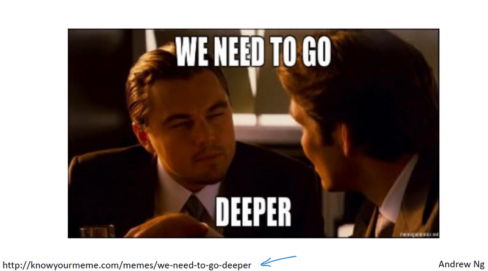

最后总结一下，如果你理解了**Inception**模块，你就能理解**Inception**网络，无非是很多个**Inception**模块一环接一环，最后组成了网络。自从**Inception**模块诞生以来，经过研究者们的不断发展，衍生了许多新的版本。所以在你们看一些比较新的**Inception**算法的论文时，会发现人们使用这些新版本的算法效果也一样很好，比如**Inception V2**、**V3**以及**V4**，还有一个版本引入了跳跃连接的方法，有时也会有特别好的效果。但所有的这些变体都建立在同一种基础的思想上，在之前的视频中你就已经学到过，就是把许多**Inception**模块通过某种方式连接到一起。通过这个视频，我想你应该能去阅读和理解这些**Inception**的论文，甚至是一些新版本的论文。

直到现在，你已经了解了许多专用的神经网络结构。在下节视频中，我将会告诉你们如何真正去使用这些算法来构建自己的计算机视觉系统，我们下节视频再见。

### 2.8 使用开源的实现方案（Using open-source implementations）

你现在已经学过几个非常有效的神经网络和**ConvNet**架构，在接下来的几段视频中我想与你分享几条如何使用它们的实用性建议，首先从使用开放源码的实现开始。

事实证明很多神经网络复杂细致，因而难以复制，因为一些参数调整的细节问题，例如学习率衰减等等，会影响性能。所以我发现有些时候，甚至在顶尖大学学习AI或者深度学习的博士生也很难通过阅读别人的研究论文来复制他人的成果。幸运的是有很多深度学习的研究者都习惯把自己的成果作为开发资源，放在像**GitHub**之类的网站上。当你自己编写代码时，我鼓励你考虑一下将你的代码贡献给开源社区。如果你看到一篇研究论文想应用它的成果，你应该考虑做一件事，我经常做的就是在网络上寻找一个开源的实现。因为你如果能得到作者的实现，通常要比你从头开始实现要快得多，虽然从零开始实现肯定可以是一个很好的锻炼。

如果你已经熟悉如何使用**GitHub**，这段视频对你来说可能没什么必要或者没那么重要。但是如果你不习惯从**GitHub**下载开源代码，让我来演示一下。

（整理者注：**ResNets**实现的**GitHub**地址<https://github.com/KaimingHe/deep-residual-networks>）

假设你对残差网络感兴趣，那就让我们搜索**GitHub**上的**ResNets**，那么你可以在**GitHub**看到很多不同的ResNet的实现。我就打开这里的第一个网址，这是一个**ResNets**实现的**GitHub**资源库。在很多**GitHub**的网页上往下翻，你会看到一些描述，这个实现的文字说明。这个**GitHub**资源库，实际上是由**ResNet**论文原作者上传的。这些代码，这里有麻省理工学院的许可，你可以点击查看此许可的含义，**MIT**许可是比较开放的开源许可之一。我将下载代码，点击这里的链接，它会给你一个**URL**，通过这个你可以下载这个代码。

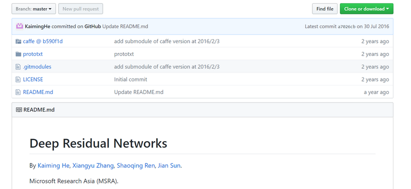

我点击这里的按钮（**Clone or download**），将这个**URL**复制到我的剪切板里。

（整理者注：**NG**此处使用的是**linux**系统的**bash**命令行，对于**win10**系统，可以开启**linux**子系统功能，然后在**win10**应用商店下载**ubuntu**安装，运行**CMD**，输入命令**bash**即可进入**linux**的**bash**命令行）

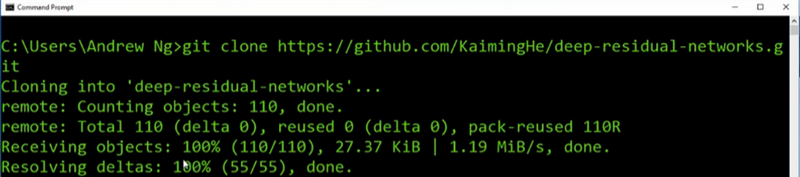

接着到这里，接下来你要做的就是输入**git clone**，接着粘贴**URL**，按下回车，几秒之内就将这个资源库的副本下载到我的本地硬盘里。

让我们进入目录，让我们看一下，比起**Windows**，我更习惯用**Mac**，不过没关系，让我们试一下，让我们进入**prototxt**，我认为这就是存放这些网络文件的地方。让我们看一下这个文件。因为这个文件很长，包含了**ResNet**里101层的详细配置。我记得，从这个网页上看到这个特殊实现使用了**Caffe**框架。但如果你想通过其它编程框架来实现这一代码，你也可以尝试寻找一下。

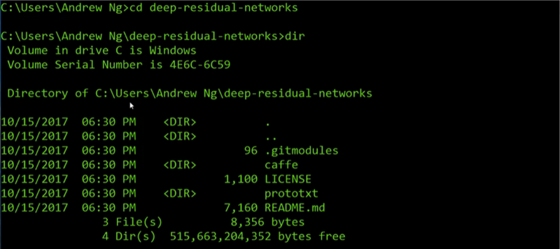

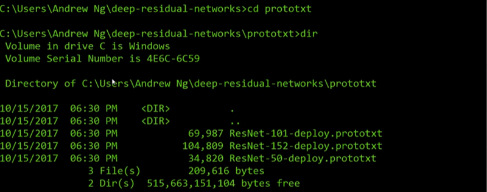

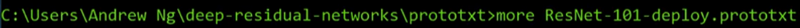

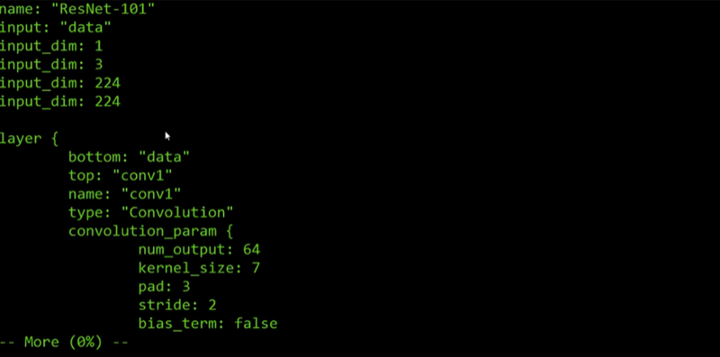

如果你在开发一个计算机视觉应用，一个常见的工作流程是，先选择一个你喜欢的架构，或许是你在这门课中学习到的，或者是你从朋友那听说的，或者是从文献中看到的，接着寻找一个开源实现，从**GitHub**下载下来，以此基础开始构建。这样做的优点在于，这些网络通常都需要很长的时间来训练，而或许有人已经使用多个**GPU**，通过庞大的数据集预先训练了这些网络，这样一来你就可以使用这些网络进行迁移学习，我们将在下一节课讨论这些内容。

当然，如果你是一名计算机视觉研究员，从零来实现这些，那么你的工作流程将会不同，如果你自己构建，那么希望你将工作成果贡献出来，放到开源社区。因为已经有如此多计算机视觉研究者为了实现这些架构做了如此之多的工作，我发现从开源项目上开始是一个更好的方法，它也确实是一个更快开展新项目的方法。

### 2.9 迁移学习（Transfer Learning）

如果你要做一个计算机视觉的应用，相比于从头训练权重，或者说从随机初始化权重开始，如果你下载别人已经训练好网络结构的权重，你通常能够进展的相当快，用这个作为预训练，然后转换到你感兴趣的任务上。计算机视觉的研究社区非常喜欢把许多数据集上传到网上，如果你听说过，比如**ImageNet**，或者**MS COCO**，或者**Pascal**类型的数据集，这些都是不同数据集的名字，它们都是由大家上传到网络的，并且有大量的计算机视觉研究者已经用这些数据集训练过他们的算法了。有时候这些训练过程需要花费好几周，并且需要很多的**GPU**，其它人已经做过了，并且经历了非常痛苦的寻最优过程，这就意味着你可以下载花费了别人好几周甚至几个月而做出来的开源的权重参数，把它当作一个很好的初始化用在你自己的神经网络上。用迁移学习把公共的数据集的知识迁移到你自己的问题上，让我们看一下怎么做。

举个例子，假如说你要建立一个猫咪检测器，用来检测你自己的宠物猫。比如网络上的**Tigger**，是一个常见的猫的名字，**Misty**也是比较常见的猫名字。假如你的两只猫叫**Tigger**和**Misty**，还有一种情况是，两者都不是。所以你现在有一个三分类问题，图片里是**Tigger**还是**Misty**，或者都不是，我们忽略两只猫同时出现在一张图片里的情况。现在你可能没有**Tigger**或者**Misty**的大量的图片，所以你的训练集会很小，你该怎么办呢？

我建议你从网上下载一些神经网络开源的实现，不仅把代码下载下来，也把权重下载下来。有许多训练好的网络，你都可以下载。举个例子，**ImageNet**数据集，它有1000个不同的类别，因此这个网络会有一个**Softmax**单元，它可以输出1000个可能类别之一。

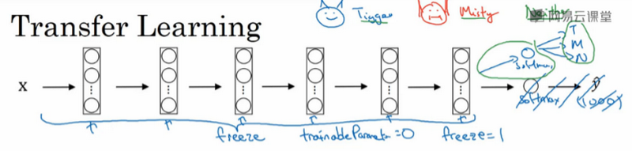

你可以去掉这个**Softmax**层，创建你自己的**Softmax**单元，用来输出**Tigger**、**Misty**和**neither**三个类别。就网络而言，我建议你把所有的层看作是冻结的，你冻结网络中所有层的参数，你只需要训练和你的**Softmax**层有关的参数。这个**Softmax**层有三种可能的输出，**Tigger**、**Misty**或者都不是。

通过使用其他人预训练的权重，你很可能得到很好的性能，即使只有一个小的数据集。幸运的是，大多数深度学习框架都支持这种操作，事实上，取决于用的框架，它也许会有`trainableParameter=0`这样的参数，对于这些前面的层，你可能会设置这个参数。为了不训练这些权重，有时也会有`freeze=1`这样的参数。不同的深度学习编程框架有不同的方式，允许你指定是否训练特定层的权重。在这个例子中，你只需要训练**softmax**层的权重，把前面这些层的权重都冻结。

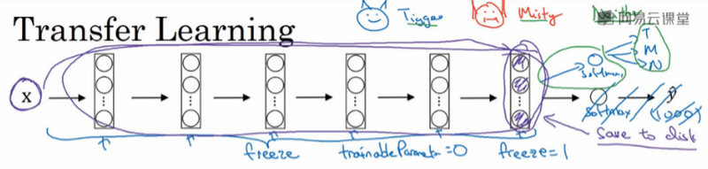

另一个技巧，也许对一些情况有用，由于前面的层都冻结了，相当于一个固定的函数，不需要改变。因为你不需要改变它，也不训练它，取输入图像$X$，然后把它映射到这层（**softmax**的前一层）的激活函数。所以这个能加速训练的技巧就是，如果我们先计算这一层（紫色箭头标记），计算特征或者激活值，然后把它们存到硬盘里。你所做的就是用这个固定的函数，在这个神经网络的前半部分（**softmax**层之前的所有层视为一个固定映射），取任意输入图像$X$，然后计算它的某个特征向量，这样你训练的就是一个很浅的**softmax**模型，用这个特征向量来做预测。对你的计算有用的一步就是对你的训练集中所有样本的这一层的激活值进行预计算，然后存储到硬盘里，然后在此之上训练**softmax**分类器。所以，存储到硬盘或者说预计算方法的优点就是，你不需要每次遍历训练集再重新计算这个激活值了。

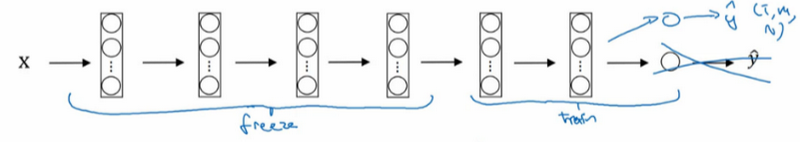

因此如果你的任务只有一个很小的数据集，你可以这样做。要有一个更大的训练集怎么办呢？根据经验，如果你有一个更大的标定的数据集，也许你有大量的**Tigger**和**Misty**的照片，还有两者都不是的，这种情况，你应该冻结更少的层，比如只把这些层冻结，然后训练后面的层。如果你的输出层的类别不同，那么你需要构建自己的输出单元，**Tigger**、**Misty**或者两者都不是三个类别。有很多方式可以实现，你可以取后面几层的权重，用作初始化，然后从这里开始梯度下降。

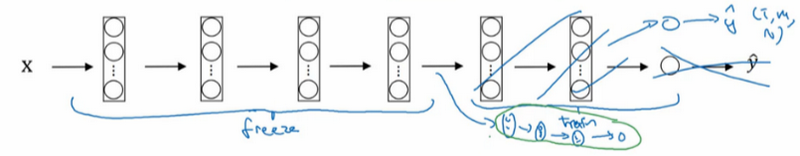

或者你可以直接去掉这几层，换成你自己的隐藏单元和你自己的**softmax**输出层，这些方法值得一试。但是有一个规律，如果你有越来越多的数据，你需要冻结的层数越少，你能够训练的层数就越多。这个理念就是，如果你有一个更大的数据集，也许有足够多的数据，那么不要单单训练一个**softmax**单元，而是考虑训练中等大小的网络，包含你最终要用的网络的后面几层。

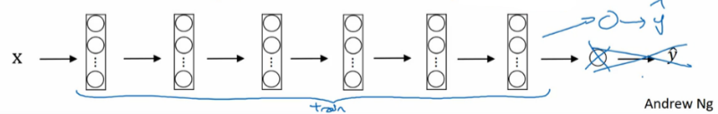

最后，如果你有大量数据，你应该做的就是用开源的网络和它的权重，把这、所有的权重当作初始化，然后训练整个网络。再次注意，如果这是一个1000节点的**softmax**，而你只有三个输出，你需要你自己的**softmax**输出层来输出你要的标签。

如果你有越多的标定的数据，或者越多的**Tigger**、**Misty**或者两者都不是的图片，你可以训练越多的层。极端情况下，你可以用下载的权重只作为初始化，用它们来代替随机初始化，接着你可以用梯度下降训练，更新网络所有层的所有权重。

这就是卷积网络训练中的迁移学习，事实上，网上的公开数据集非常庞大，并且你下载的其他人已经训练好几周的权重，已经从数据中学习了很多了，你会发现，对于很多计算机视觉的应用，如果你下载其他人的开源的权重，并用作你问题的初始化，你会做的更好。在所有不同学科中，在所有深度学习不同的应用中，我认为计算机视觉是一个你经常用到迁移学习的领域，除非你有非常非常大的数据集，你可以从头开始训练所有的东西。总之，迁移学习是非常值得你考虑的，除非你有一个极其大的数据集和非常大的计算量预算来从头训练你的网络。

### 2.10 数据增强（Data augmentation）

大部分的计算机视觉任务使用很多的数据，所以数据扩充是经常使用的一种技巧来提高计算机视觉系统的表现。我认为计算机视觉是一个相当复杂的工作，你需要输入图像的像素值，然后弄清楚图片中有什么，似乎你需要学习一个复杂方程来做这件事。在实践中，更多的数据对大多数计算机视觉任务都有所帮助，不像其他领域，有时候得到充足的数据，但是效果并不怎么样。但是，当下在计算机视觉方面，计算机视觉的主要问题是没有办法得到充足的数据。对大多数机器学习应用，这不是问题，但是对计算机视觉，数据就远远不够。所以这就意味着当你训练计算机视觉模型的时候，数据扩充会有所帮助，这是可行的，无论你是使用迁移学习，使用别人的预训练模型开始，或者从源代码开始训练模型。让我们来看一下计算机视觉中常见的数据扩充的方法。

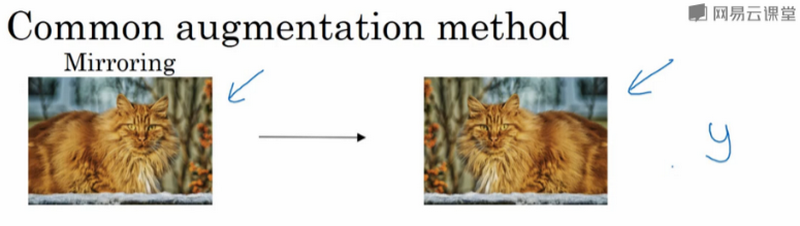

或许最简单的数据扩充方法就是垂直镜像对称，假如，训练集中有这张图片，然后将其翻转得到右边的图像。对大多数计算机视觉任务，左边的图片是猫，然后镜像对称仍然是猫，如果镜像操作保留了图像中想识别的物体的前提下，这是个很实用的数据扩充技巧。

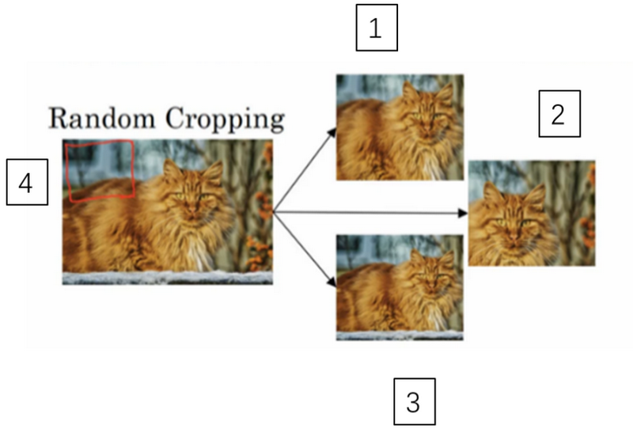

另一个经常使用的技巧是随机裁剪，给定一个数据集，然后开始随机裁剪，可能修剪这个（编号1），选择裁剪这个（编号2），这个（编号3），可以得到不同的图片放在数据集中，你的训练集中有不同的裁剪。随机裁剪并不是一个完美的数据扩充的方法，如果你随机裁剪的那一部分（红色方框标记部分，编号4），这部分看起来不像猫。但在实践中，这个方法还是很实用的，随机裁剪构成了很大一部分的真实图片。

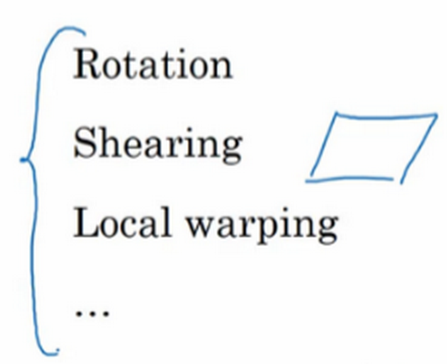

镜像对称和随机裁剪是经常被使用的。当然，理论上，你也可以使用旋转，剪切（**shearing**：此处并非裁剪的含义，图像仅水平或垂直坐标发生变化）图像，可以对图像进行这样的扭曲变形，引入很多形式的局部弯曲等等。当然使用这些方法并没有坏处，尽管在实践中，因为太复杂了所以使用的很少。

第二种经常使用的方法是彩色转换，有这样一张图片，然后给**R**、**G**和**B**三个通道上加上不同的失真值。

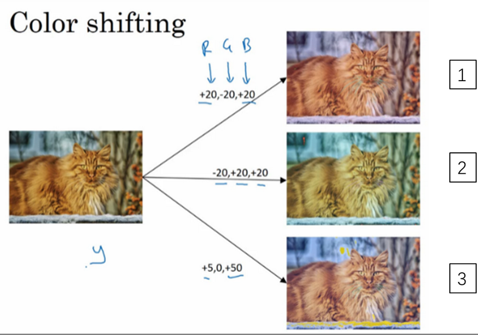

在这个例子中（编号1），要给红色、蓝色通道加值，给绿色通道减值。红色和蓝色会产生紫色，使整张图片看起来偏紫，这样训练集中就有失真的图片。为了演示效果，我对图片的颜色进行改变比较夸张。在实践中，对**R**、**G**和**B**的变化是基于某些分布的，这样的改变也可能很小。

这么做的目的就是使用不同的**R**、**G**和**B**的值，使用这些值来改变颜色。在第二个例子中（编号2），我们少用了一点红色，更多的绿色和蓝色色调，这就使得图片偏黄一点。

在这（编号3）使用了更多的蓝色，仅仅多了点红色。在实践中，**R**、**G**和**B**的值是根据某种概率分布来决定的。这么做的理由是，可能阳光会有一点偏黄，或者是灯光照明有一点偏黄，这些可以轻易的改变图像的颜色，但是对猫的识别，或者是内容的识别，以及标签$y$，还是保持不变的。所以介绍这些，颜色失真或者是颜色变换方法，这样会使得你的学习算法对照片的颜色更改更具鲁棒性。

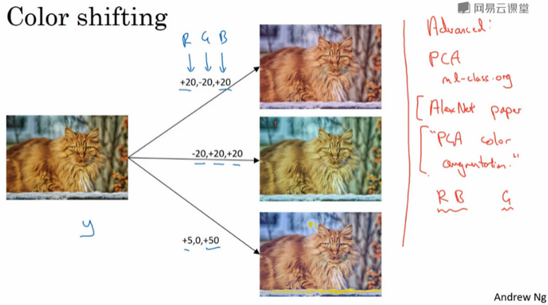

这是对更高级的学习者的一些注意提醒，你可以不理解我用红色标出来的内容。对**R、G和B**有不同的采样方式，其中一种影响颜色失真的算法是**PCA**，即主成分分析，我在机器学习的**mooc**中讲过，在**Coursera ml-class.Org**机器学习这门课中。但具体颜色改变的细节在**AlexNet**的论文中有时候被称作**PCA**颜色增强，**PCA**颜色增强的大概含义是，比如说，如果你的图片呈现紫色，即主要含有红色和蓝色，绿色很少，然后**PCA**颜色增强算法就会对红色和蓝色增减很多，绿色变化相对少一点，所以使总体的颜色保持一致。如果这些你都不懂，不需要担心，可以在网上搜索你想要了解的东西，如果你愿意的话可以阅读**AlexNet**论文中的细节，你也能找到**PCA**颜色增强的开源实现方法，然后直接使用它。

你可能有存储好的数据，你的训练数据存在硬盘上，然后使用符号，这个圆桶来表示你的硬盘。如果你有一个小的训练数据，你可以做任何事情，这些数据集就够了。

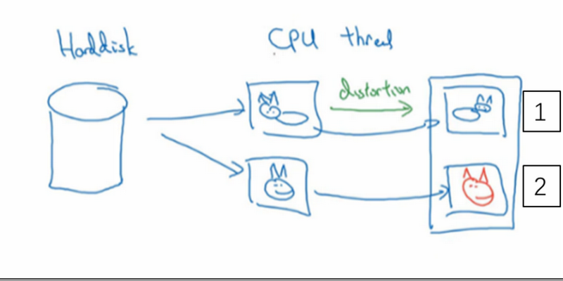

但是你有特别大的训练数据，接下来这些就是人么经常使用的方法。你可能会使用**CPU**线程，然后它不停的从硬盘中读取数据，所以你有一个从硬盘过来的图片数据流。你可以用**CPU**线程来实现这些失真变形，可以是随机裁剪、颜色变化，或者是镜像。但是对每张图片得到对应的某一种变形失真形式，看这张图片（编号1），对其进行镜像变换，以及使用颜色失真，这张图最后会颜色变化（编号2），从而得到不同颜色的猫。

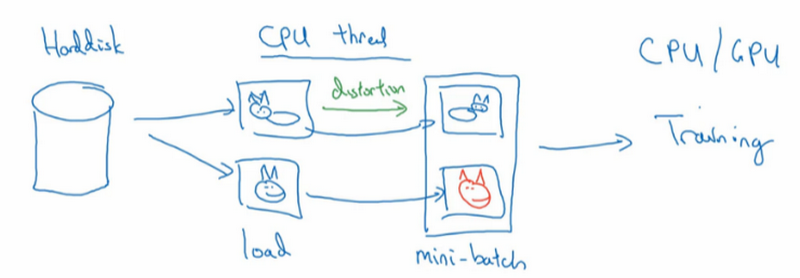

与此同时，**CPU**线程持续加载数据，然后实现任意失真变形，从而构成批数据或者最小批数据，这些数据持续的传输给其他线程或者其他的进程，然后开始训练，可以在**CPU**或者**GPU**上实现训一个大型网络的训练。

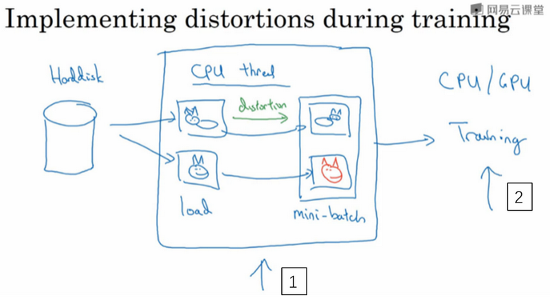

常用的实现数据扩充的方法是使用一个线程或者是多线程，这些可以用来加载数据，实现变形失真，然后传给其他的线程或者其他进程，来训练这个（编号2）和这个（编号1），可以并行实现。

这就是数据扩充，与训练深度神经网络的其他部分类似，在数据扩充过程中也有一些超参数，比如说颜色变化了多少，以及随机裁剪的时候使用的参数。与计算机视觉其他部分类似，一个好的开始可能是使用别人的开源实现，了解他们如何实现数据扩充。当然如果你想获得更多的不变特性，而其他人的开源实现并没有实现这个，你也可以去调整这些参数。因此，我希望你们可以使用数据扩充使你的计算机视觉应用效果更好。

### 2.11 计算机视觉现状（The state of computer vision）

深度学习已经成功地应用于计算机视觉、自然语言处理、语音识别、在线广告、物流还有其他许多问题。在计算机视觉的现状下，深度学习应用于计算机视觉应用有一些独特之处。在这个视频中，我将和你们分享一些我对深度学习在计算机视觉方面应用的认识，希望能帮助你们更好地理解计算机视觉作品（此处指计算机视觉或者数据竞赛中的模型）以及其中的想法，以及如何自己构建这些计算机视觉系统。

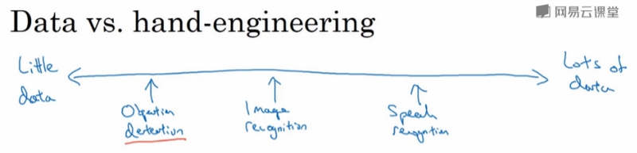

你可以认为大部分机器学习问题是介于少量数据和大量数据范围之间的。举个例子，我认为今天我们有相当数量的语音识别数据，至少相对于这个问题的复杂性而言。虽然现在图像识别或图像分类方面有相当大的数据集，因为图像识别是一个复杂的问题，通过分析像素并识别出它是什么，感觉即使在线数据集非常大，如超过一百万张图片，我们仍然希望我们能有更多的数据。还有一些问题，比如物体检测，我们拥有的数据更少。提醒一下，图像识别其实是如何看图片的问题，并且告诉你这张图是不是猫，而对象检测则是看一幅图，你画一个框，告诉你图片里的物体，比如汽车等等。因为获取边框的成本比标记对象的成本更高，所以我们进行对象检测的数据往往比图像识别数据要少，对象检测是我们下周要讨论的内容。

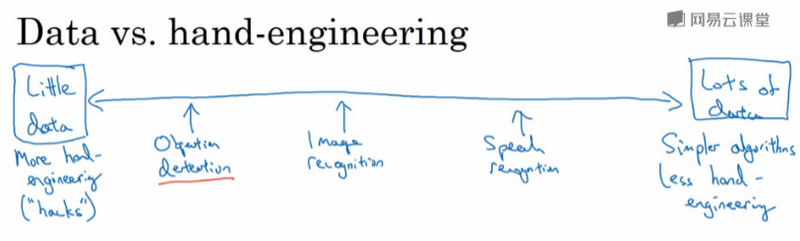

所以，观察一下机器学习数据范围图谱，你会发现当你有很多数据时，人们倾向于使用更简单的算法和更少的手工工程，因为我们不需要为这个问题精心设计特征。当你有大量的数据时，只要有一个大型的神经网络，甚至一个更简单的架构，可以是一个神经网络，就可以去学习它想学习的东西。

相反当你没有那么多的数据时，那时你会看到人们从事更多的是手工工程，低调点说就是你有很多小技巧可用（整理者注：在机器学习或者深度学习中，一般更崇尚更少的人工处理，而手工工程更多依赖人工处理，注意领会Andrew NG的意思）。但我认为每你没有太多数据时，手工工程实际上是获得良好表现的最佳方式。

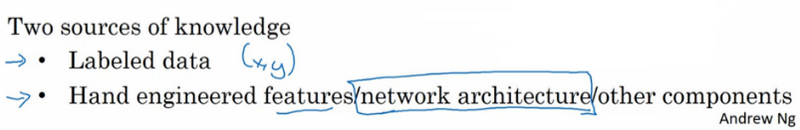

所以当我看机器学习应用时，我们认为通常我们的学习算法有两种知识来源，一个来源是被标记的数据，就像$(x，y)$应用在监督学习。第二个知识来源是手工工程，有很多方法去建立一个手工工程系统，它可以是源于精心设计的特征，手工精心设计的网络体系结构或者是系统的其他组件。所以当你没有太多标签数据时，你只需要更多地考虑手工工程。

所以我认为计算机视觉是在试图学习一个非常复杂的功能，我们经常感觉我们没有足够的数据，即使获得了更多数据，我们还是经常觉得还是没有足够的数据来满足需求。这就是为什么计算机视觉，从过去甚至到现在都更多地依赖于手工工程。我认为这也是计算机视觉领域发展相当复杂网络架构地原因，因为在缺乏更多数据的情况下，获得良好表现的方式还是花更多时间进行架构设计，或者说在网络架构设计上浪费（贬义褒用，即需要花费更多时间的意思）更多时间。

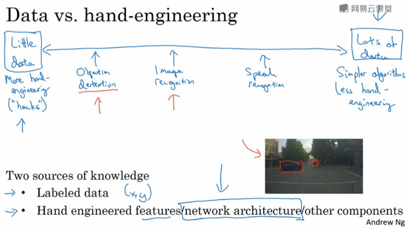

如果你认为我是在贬低手工工程，那并不是我的意思，当你没有足够的数据时，手工工程是一项非常困难，非常需要技巧的任务，它需要很好的洞察力，那些对手工工程有深刻见解的人将会得到更好的表现。当你没有足够的数据时，手工工程对一个项目来说贡献就很大。当你有很多数据的时候我就不会花时间去做手工工程，我会花时间去建立学习系统。但我认为从历史而言，计算机视觉领域还只是使用了非常小的数据集，因此从历史上来看计算机视觉还是依赖于大量的手工工程。甚至在过去的几年里，计算机视觉任务的数据量急剧增加，我认为这导致了手工工程量大幅减少，但是在计算机视觉上仍然有很多的网络架构使用手工工程，这就是为什么你会在计算机视觉中看到非常复杂的超参数选择，比你在其他领域中要复杂的多。实际上，因为你通常有比图像识别数据集更小的对象检测数据集，当我们谈论对象检测时，其实这是下周的任务，你会看到算法变得更加复杂，而且有更多特殊的组件。

幸运的是，当你有少量的数据时，有一件事对你很有帮助，那就是迁移学习。我想说的是，在之前的幻灯片中，**Tigger**、**Misty**或者二者都不是的检测问题中，我们有这么少的数据，迁移学习会有很大帮助。这是另一套技术，当你有相对较少的数据时就可以用很多相似的数据。

如果你看一下计算机视觉方面的作品，看看那里的创意，你会发现人们真的是踌躇满志，他们在基准测试中和竞赛中表现出色。对计算机视觉研究者来说，如果你在基准上做得很好了，那就更容易发表论文了，所以有许多人致力于这些基准上，把它做得很好。积极的一面是，它有助于整个社区找出最有效得算法。但是你在论文上也看到，人们所做的事情让你在数据基准上表现出色，但你不会真正部署在一个实际得应用程序用在生产或一个系统上。

（整理着注：**Benchmark** 基准测试，**Benchmark**是一个评价方式，在整个计算机领域有着长期的应用。维基百科上解释：“As computer architecture advanced, it became more difficult to compare the performance of various computer systems simply by looking at their specifications.Therefore, tests were developed that allowed comparison of different architectures.”Benchmark在计算机领域应用最成功的就是性能测试，主要测试负载的执行时间、传输速度、吞吐量、资源占用率等。）

下面是一些有助于在基准测试中表现出色的小技巧，这些都是我自己从来没使用过的东西，如果我把一个系统投入生产，那就是为客户服务。

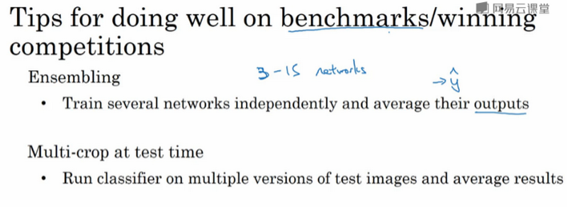

其中一个是集成，这就意味着在你想好了你想要的神经网络之后，可以独立训练几个神经网络，并平均它们的输出。比如说随机初始化三个、五个或者七个神经网络，然后训练所有这些网络，然后平均它们的输出。另外对他们的输出$\hat y$进行平均计算是很重要的，不要平均他们的权重，这是行不通的。看看你的7个神经网络，它们有7个不同的预测，然后平均他们，这可能会让你在基准上提高1%，2%或者更好。这会让你做得更好，也许有时会达到1%或2%，这真的能帮助你赢得比赛。但因为集成意味着要对每张图片进行测试，你可能需要在从3到15个不同的网络中运行一个图像，这是很典型的，因为这3到15个网络可能会让你的运行时间变慢，甚至更多时间，所以技巧之一的集成是人们在基准测试中表现出色和赢得比赛的利器，但我认为这几乎不用于生产服务于客户的，我想除非你有一个巨大的计算预算而且不介意在每个用户图像数据上花费大量的计算。

你在论文中可以看到在测试时，对进准测试有帮助的另一个技巧就是**Multi-crop at test time**，我的意思是你已经看到了如何进行数据扩充，**Multi-crop**是一种将数据扩充应用到你的测试图像中的一种形式。

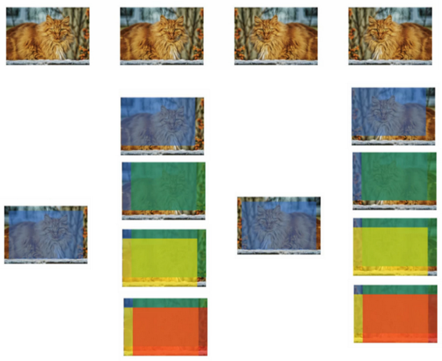

举个例子，让我们看看猫的图片，然后把它复制四遍，包括它的两个镜像版本。有一种叫作**10-crop**的技术（**crop**理解为裁剪的意思），它基本上说，假设你取这个中心区域，裁剪，然后通过你的分类器去运行它，然后取左上角区域，运行你的分类器，右上角用绿色表示，左下方用黄色表示，右下方用橙色表示，通过你的分类器来运行它，然后对镜像图像做同样的事情对吧？所以取中心的**crop**，然后取四个角落的**crop**。

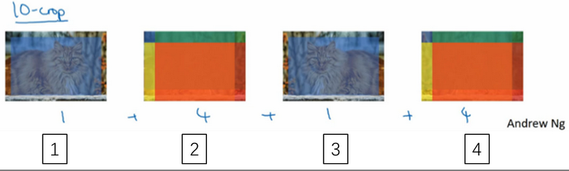

这是这里（编号1）和这里（编号3）就是中心**crop**，这里（编号2）和这里（编号4）就是四个角落的**crop**。如果把这些加起来，就会有10种不同的图像的**crop**，因此命名为**10-crop**。所以你要做的就是，通过你的分类器来运行这十张图片，然后对结果进行平均。如果你有足够的计算预算，你可以这么做，也许他们需要10个**crops**，你可以使用更多，这可能会让你在生产系统中获得更好的性能。如果是生产的话，我的意思还是实际部署用户的系统。但这是另一种技术，它在基准测试上的应用，要比实际生产系统中好得多。

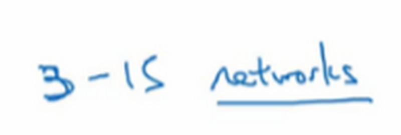

集成的一个大问题是你需要保持所有这些不同的神经网络，这就占用了更多的计算机内存。对于**multi-crop**，我想你只保留一个网络，所以它不会占用太多的内存，但它仍然会让你的运行时间变慢。

这些是你看到的小技巧，研究论文也可以参考这些，但我个人并不倾向于在构建生产系统时使用这些方法，尽管它们在基准测试和竞赛上做得很好。

由于计算机视觉问题建立在小数据集之上，其他人已经完成了大量的网络架构的手工工程。一个神经网络在某个计算机视觉问题上很有效，但令人惊讶的是它通常也会解决其他计算机视觉问题。

所以，要想建立一个实用的系统，你最好先从其他人的神经网络架构入手。如果可能的话，你可以使用开源的一些应用，因为开放的源码实现可能已经找到了所有繁琐的细节，比如学习率衰减方式或者超参数。

最后，其他人可能已经在几路**GPU**上花了几个星期的时间来训练一个模型，训练超过一百万张图片，所以通过使用其他人的预先训练得模型，然后在数据集上进行微调，你可以在应用程序上运行得更快。当然如果你有电脑资源并且有意愿，我不会阻止你从头开始训练你自己的网络。事实上，如果你想发明你自己的计算机视觉算法，这可能是你必须要做的。

这就是本周的学习，我希望看到大量的计算机视觉架构能够帮助你理解什么是有效的。在本周的编程练习中，你实际上会学习另一种编程框架，并使用它来实现**ResNets**。所以我希望你们喜欢这个编程练习，我期待下周还能见到你们。

**参考文献：**

- Kaiming He, Xiangyu Zhang, Shaoqing Ren, Jian Sun - [Deep Residual Learning for Image Recognition (2015)](https://arxiv.org/abs/1512.03385)
- Francois Chollet's github repository: <https://github.com/fchollet/deep-learning-models/blob/master/resnet50.py>