第四周 特殊应用：人脸识别和神经风格转换（Special applications: Face recognition &Neural style transfer）
------------------------------------------------------------------------

 

[TOC]
### 4.1 什么是人脸识别？（What is face recognition?）

欢迎来到第四周，即这门课卷积神经网络课程的最后一周。到目前为止，你学了很多卷积神经网络的知识。我这周准备向你展示一些重要的卷积神经网络的特殊应用，我们将从人脸识别开始，之后讲神经风格迁移，你将有机会在编程作业中实现这部分内容，创造自己的艺术作品。

让我们先从人脸识别开始，我这里有一个有意思的演示。我在领导百度**AI**团队的时候，其中一个小组由林元庆带领的，做过一个人脸识别系统，这个系统非常棒，让我们来看一下。

（以下内容为演示视频内容）

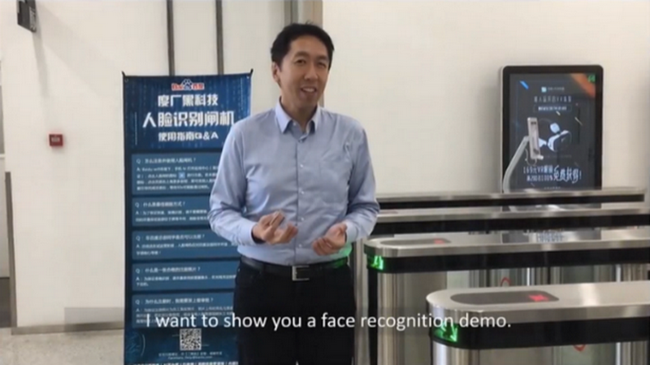

**视频开始：**

我想演示一个人脸识别系统，我现在在百度的中国总部，很多公司要求进入公司的时候要刷工卡，但是在这里我们并不需要它，使用人脸识别，看看我能做什么。当我走近的时候，它会识别我的脸，然后说欢迎我（**Andrew NG**），不需要工卡，我就能通过了。

让我们看看另一种情况，在旁边的是林元庆，**IDL**（百度深度学习实验室）的主管，他领导开发了这个人脸识别系统，我把我的工卡给他，上面有我的头像，他会试着用我的头像照片，而不是真人来通过。

（林元庆语：我将尝试用**Andrew**的工卡骗过机器，看看发生什么，系统不会识别，系统拒绝识别。现在我要用我自己的脸，（系统语音：“欢迎您”）（林元庆顺利通过））

类似于这样的人脸识别系统在中国发展很快，我希望这个技术也可以在其他的国家使用。

**\#视频结束**

挺厉害的吧，你刚看到的这个视频展示了人脸识别和活体检测，后一项技术确认你是一个活人。事实上，活体检测可以使用监督学习来实现，去预测是不是一个真人，这个方面我就不多说了。我主要想讲的是，如何构造这个系统中的人脸识别这一部分。

首先，让我们了解一下人脸识别的一些术语。

在人脸识别的相关文献中，人们经常提到人脸验证（**face verification**）和人脸识别（**face recognition**）。

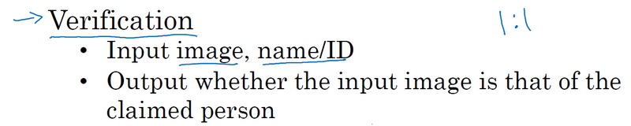

这是人脸验证问题，如果你有一张输入图片，以及某人的**ID**或者是名字，这个系统要做的是，验证输入图片是否是这个人。有时候也被称作1对1问题，只需要弄明白这个人是否和他声称的身份相符。

而人脸识别问题比人脸验证问题难很多（整理者注：1对多问题（$1:K$）），为什么呢？假设你有一个验证系统，准确率是99%，还可以。但是现在，假设在识别系统中，$K=100$，如果你把这个验证系统应用在100个人身上，人脸识别上，你犯错的机会就是100倍了。如果每个人犯错的概率是1%，如果你有一个上百人的数据库，如果你想得到一个可接受的识别误差，你要构造一个验证系统，其准确率为99.9%或者更高，然后才可以在100人的数据库上运行，而保证有很大几率不出错。事实上，如果我们有一个100人的数据库，正确率可能需要远大于99%，才能得到很好的效果。

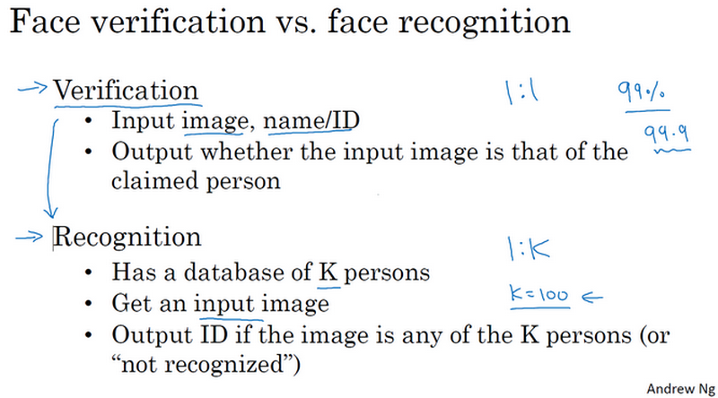

在之后的几个视频中，我们主要讲构造一个人脸验证，作为基本模块，如果准确率够高，你就可以把它用在识别系统上。

下一个视频中，我们将开始讨论如何构造人脸验证系统，人脸验证之所以难，原因之一在于要解决“一次学”（**one-shot learning problem**）问题。让我们看下一个视频，什么是一次学习问题。

### 4.2 One-Shot学习（One-shot learning）

人脸识别所面临的一个挑战就是你需要解决一次学习问题，这意味着在大多数人脸识别应用中，你需要通过单单一张图片或者单单一个人脸样例就能去识别这个人。而历史上，当深度学习只有一个训练样例时，它的表现并不好，让我们看一个直观的例子，并讨论如何去解决这个问题。

假设你的数据库里有4张你们公司的员工照片，实际上他们确实是我们**deeplearning.ai**的员工，分别是**Kian**，**Danielle**，**Younes**和**Tian**。现在假设有个人（编号1所示）来到办公室，并且她想通过带有人脸识别系统的栅门，现在系统需要做的就是，仅仅通过一张已有的**Danielle**照片，来识别前面这个人确实是她。相反，如果机器看到一个不在数据库里的人（编号2所示），机器应该能分辨出她不是数据库中四个人之一。

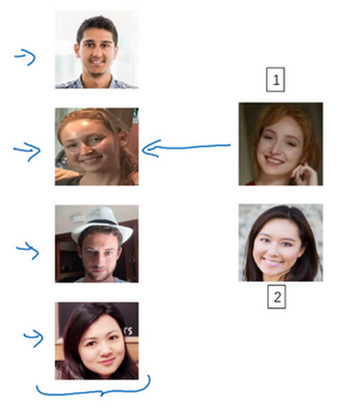

所以在一次学习问题中，只能通过一个样本进行学习，以能够认出同一个人。大多数人脸识别系统都需要解决这个问题，因为在你的数据库中每个雇员或者组员可能都只有一张照片。

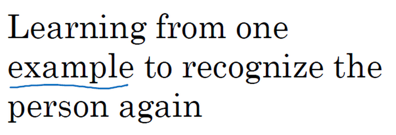

有一种办法是，将人的照片放进卷积神经网络中，使用**softmax**单元来输出4种，或者说5种标签，分别对应这4个人，或者4个都不是，所以**softmax**里我们会有5种输出。但实际上这样效果并不好，因为如此小的训练集不足以去训练一个稳健的神经网络。

而且，假如有新人加入你的团队，你现在将会有5个组员需要识别，所以输出就变成了6种，这时你要重新训练你的神经网络吗？这听起来实在不像一个好办法。

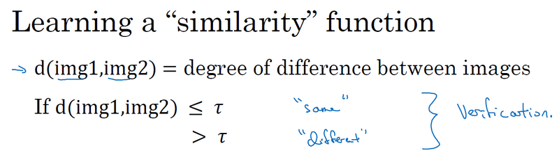

所以要让人脸识别能够做到一次学习，为了能有更好的效果，你现在要做的应该是学习**Similarity**函数。详细地说，你想要神经网络学习这样一个用$d$表示的函数，$d(img1,img2) = degree\ of\ difference\ between\ images$，它以两张图片作为输入，然后输出这两张图片的差异值。如果你放进同一个人的两张照片，你希望它能输出一个很小的值，如果放进两个长相差别很大的人的照片，它就输出一个很大的值。所以在识别过程中，如果这两张图片的差异值小于某个阈值$\tau$，它是一个超参数，那么这时就能预测这两张图片是同一个人，如果差异值大于τ，就能预测这是不同的两个人，这就是解决人脸验证问题的一个可行办法。

要将它应用于识别任务，你要做的是拿这张新图片（编号6），然后用$d$函数去比较这两张图片（编号1和编号6），这样可能会输出一个非常大的数字，在该例中，比如说这个数字是10。之后你再让它和数据库中第二张图（编号2）片比较，因为这两张照片是同一个人，所以我们希望会输出一个很小的数。然后你再用它与数据库中的其他图片（编号3、4）进行比较，通过这样的计算，最终你能够知道，这个人确实是**Danielle**。

对应的，如果某个人（编号7）不在你的数据库中，你通过函数$d$将他们的照片两两进行比较，最后我们希望$d$会对所有的比较都输出一个很大的值，这就证明这个人并不是数据库中4个人的其中一个。

要注意在这过程中你是如何解决一次学习问题的，只要你能学习这个函数$d$，通过输入一对图片，它将会告诉你这两张图片是否是同一个人。如果之后有新人加入了你的团队（编号5），你只需将他的照片加入你的数据库，系统依然能照常工作。

现在你已经知道函数d是如何工作的，通过输入两张照片，它将让你能够解决一次学习问题。那么，下节视频中，我们将会学习如何训练你的神经网络学会这个函数$d$。

### 4.3 Siamese 网络（Siamese network）

上个视频中你学到的函数$d$的作用就是输入两张人脸，然后告诉你它们的相似度。实现这个功能的一个方式就是用**Siamese**网络，我们看一下。

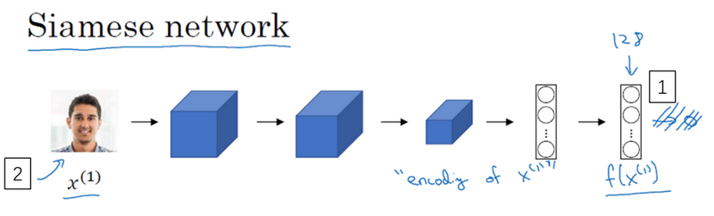

你经常看到这样的卷积网络，输入图片$x^{(1)}$，然后通过一些列卷积，池化和全连接层，最终得到这样的特征向量（编号1）。有时这个会被送进**softmax**单元来做分类，但在这个视频里我们不会这么做。我们关注的重点是这个向量（编号1），假如它有128个数，它是由网络深层的全连接层计算出来的，我要给这128个数命个名字，把它叫做$f(x^{(1)})$。你可以把$f(x^{(1)})$看作是输入图像$x^{(1)}$的编码，取这个输入图像（编号2），在这里是**Kian**的图片，然后表示成128维的向量。

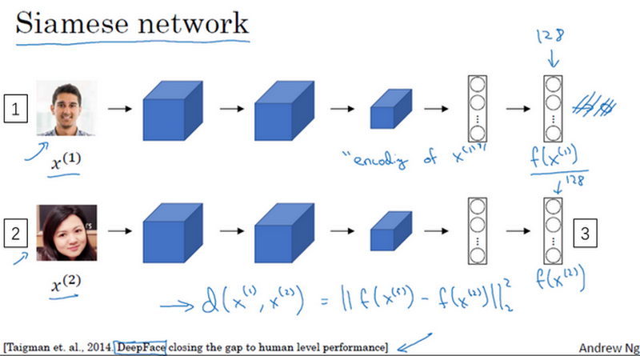

建立一个人脸识别系统的方法就是，如果你要比较两个图片的话，例如这里的第一张（编号1）和第二张图片（编号2），你要做的就是把第二张图片喂给有同样参数的同样的神经网络，然后得到一个不同的128维的向量（编号3），这个向量代表或者编码第二个图片，我要把第二张图片的编码叫做$f(x^{(2)})$。这里我用$x^{(1)}$和$x^{(2)}$仅仅代表两个输入图片，他们没必要非是第一个和第二个训练样本，可以是任意两个图片。

最后如果你相信这些编码很好地代表了这两个图片，你要做的就是定义$d$，将$x^{(1)}$和$x^{(2)}$的距离定义为这两幅图片的编码之差的范数，$d( x^{( 1)},x^{( 2)}) =|| f( x^{( 1)}) - f( x^{( 2)})||_{2}^{2}$。

对于两个不同的输入，运行相同的卷积神经网络，然后比较它们，这一般叫做**Siamese**网络架构。这里提到的很多观点，都来自于**Yaniv Taigman**，**Ming Yang**，**Marc’ Aurelio Ranzato**，**Lior Wolf**的这篇论文，他们开发的系统叫做**DeepFace**。

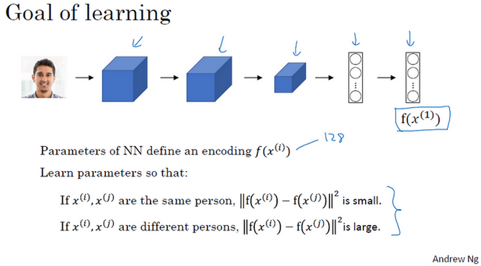

怎么训练这个**Siamese**神经网络呢？不要忘了这两个网络有相同的参数，所以你实际要做的就是训练一个网络，它计算得到的编码可以用于函数$d$，它可以告诉你两张图片是否是同一个人。更准确地说，神经网络的参数定义了一个编码函数$f(x^{(i)})$，如果给定输入图像$x^{(i)}$，这个网络会输出$x^{(i)}$的128维的编码。你要做的就是学习参数，使得如果两个图片$x^{( i)}$和$x^{( j)}$是同一个人，那么你得到的两个编码的距离就小。前面几个幻灯片我都用的是$x^{(1)}$和$x^{( 2)}$，其实训练集里任意一对$x^{(i)}$和$x^{(j)}$都可以。相反，如果$x^{(i)}$和$x^{(j)}$是不同的人，那么你会想让它们之间的编码距离大一点。

如果你改变这个网络所有层的参数，你会得到不同的编码结果，你要做的就是用反向传播来改变这些所有的参数，以确保满足这些条件。

你已经了解了**Siamese**网络架构，并且知道你想要网络输出什么，即什么是好的编码。但是如何定义实际的目标函数，能够让你的神经网络学习并做到我们刚才讨论的内容呢？在下一个视频里，我们会看到如何用三元组损失函数达到这个目的。

### 4.4 Triplet 损失（Triplet 损失）

要想通过学习神经网络的参数来得到优质的人脸图片编码，方法之一就是定义三元组损失函数然后应用梯度下降。

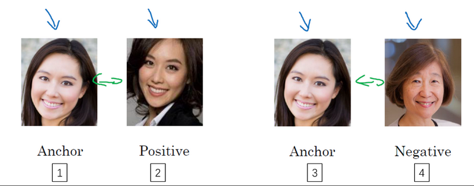

我们看下这是什么意思，为了应用三元组损失函数，你需要比较成对的图像，比如这个图片，为了学习网络的参数，你需要同时看几幅图片，比如这对图片（编号1和编号2），你想要它们的编码相似，因为这是同一个人。然而假如是这对图片（编号3和编号4），你会想要它们的编码差异大一些，因为这是不同的人。

用三元组损失的术语来说，你要做的通常是看一个 **Anchor** 图片，你想让**Anchor**图片和**Positive**图片（**Positive**意味着是同一个人）的距离很接近。然而，当**Anchor**图片与**Negative**图片（**Negative**意味着是非同一个人）对比时，你会想让他们的距离离得更远一点。

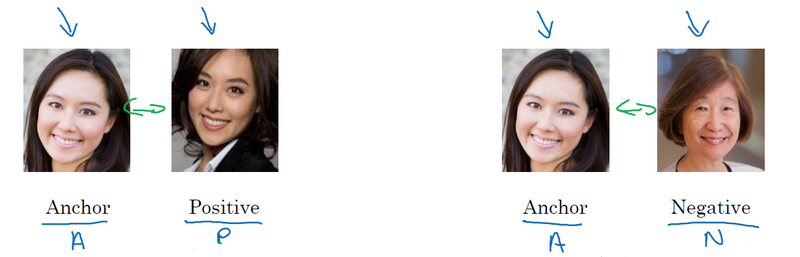

这就是为什么叫做三元组损失，它代表你通常会同时看三张图片，你需要看**Anchor**图片、**Postive**图片，还有**Negative**图片，我要把**Anchor**图片、**Positive**图片和**Negative**图片简写成$A$、$P$、$N$。

把这些写成公式的话，你想要的是网络的参数或者编码能够满足以下特性，也就是说你想要$|| f(A) - f(P) ||^{2}$，你希望这个数值很小，准确地说，你想让它小于等$f(A)$和$f(N)$之间的距离，或者说是它们的范数的平方（即：$|| f(A) - f(P)||^{2} \leq ||f(A) - f(N)||^{2}$）。（$|| f(A) - f(P) ||^{2}$）当然这就是$d(A,P)$，（$|| f(A) - f(N) ||^{2}$）这是$d(A,N)$，你可以把$d$ 看作是距离(**distance**)函数，这也是为什么我们把它命名为$d$。

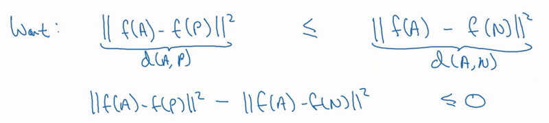

现在如果我把方程右边项移到左边，最终就得到：

$|| f(A) - f(P)||^{2} \leq ||f(A) - f(N)||^{2}$

现在我要对这个表达式做一些小的改变，有一种情况满足这个表达式，但是没有用处，就是把所有的东西都学成0，如果$f$总是输出0，即0-0≤0，这就是0减去0还等于0，如果所有图像的$f$都是一个零向量，那么总能满足这个方程。所以为了确保网络对于所有的编码不会总是输出0，也为了确保它不会把所有的编码都设成互相相等的。另一种方法能让网络得到这种没用的输出，就是如果每个图片的编码和其他图片一样，这种情况，你还是得到0-0。

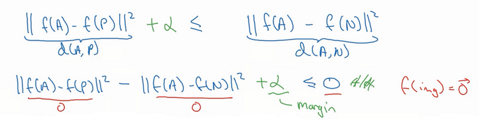

为了阻止网络出现这种情况，我们需要修改这个目标，也就是，这个不能是刚好小于等于0，应该是比0还要小，所以这个应该小于一个$-a$值（即$|| f(A) - f(P)||^{2} -||f(A) - f(N)||^{2} \leq -a$），这里的$a$是另一个超参数，这个就可以阻止网络输出无用的结果。按照惯例，我们习惯写$+a$（即$|| f(A) - f(P)||^{2} -||f(A) - f(N)||^{2} +a\leq0$），而不是把$-a$写在后面，它也叫做间隔(**margin**)，这个术语你会很熟悉，如果你看过关于支持向量机 (**SVM**)的文献，没看过也不用担心。我们可以把上面这个方程（$|| f(A) - f(P)||^{2}  -||f(A) - f(N)||^{2}$）也修改一下，加上这个间隔参数。haox 

举个例子，假如间隔设置成0.2，如果在这个例子中，$d(A,P) =0.5$，如果 **Anchor**和 **Negative**图片的$d$，即$d(A,N)$只大一点，比如说0.51，条件就不能满足。虽然0.51也是大于0.5的，但还是不够好，我们想要$d(A,N)$比$d(A,P)$大很多，你会想让这个值（$d(A,N)$）至少是0.7或者更高，或者为了使这个间隔，或者间距至少达到0.2，你可以把这项调大或者这个调小，这样这个间隔$a$，超参数$a$ 至少是0.2，在$d(A,P)$和$d(A,N)$之间至少相差0.2，这就是间隔参数$a$的作用。它拉大了**Anchor**和**Positive** 图片对和**Anchor**与**Negative** 图片对之间的差距。取下面的这个方框圈起来的方程式，在下个幻灯片里，我们会更公式化表示，然后定义三元组损失函数。

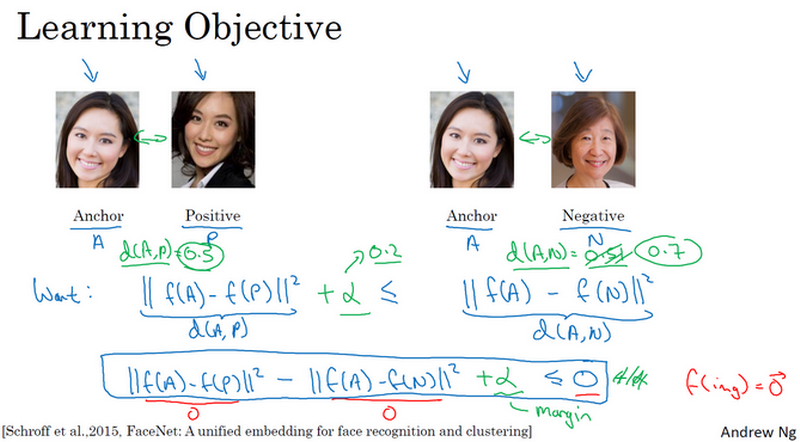

三元组损失函数的定义基于三张图片，假如三张图片$A$、$P$、$N$，即**Anchor**样本、**Positive**样本和**Negative**样本，其中**Positive**图片和**Anchor**图片是同一个人，但是**Negative**图片和**Anchor**不是同一个人。

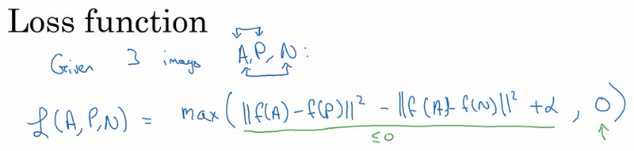

接下来我们定义损失函数，这个例子的损失函数，它的定义基于三元图片组，我先从前一张幻灯片复制过来一些式子，就是$|| f( A) - f( P)||^{2} -||f( A) - f( N)||^{2} +a \leq0$。所以为了定义这个损失函数，我们取这个和0的最大值：

$L( A,P,N) = max(|| f( A) - f( P)||^{2} -|| f( A) - f( N)||^{2} + a,0)$

这个$max$函数的作用就是，只要这个$|| f( A) - f( P)||^{2} -|| f( A) - f( N)||^{2} + a\leq0$，那么损失函数就是0。只要你能使画绿色下划线部分小于等于0，只要你能达到这个目标，那么这个例子的损失就是0。

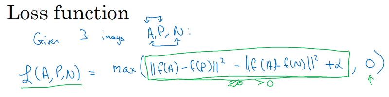

另一方面如果这个$|| f( A) - f( P)||^{2} -|| f( A) - f( N)||^{2} + a\leq0$，然后你取它们的最大值，最终你会得到绿色下划线部分（即$|| f(A) - f( P)||^{2} -|| f( A) - f( N)||^{2} +a$）是最大值，这样你会得到一个正的损失值。通过最小化这个损失函数达到的效果就是使这部分$|| f( A) - f( P)||^{2} -||f( A) - f( N)||^{2} +a$成为0，或者小于等于0。只要这个损失函数小于等于0，网络不会关心它负值有多大。

这是一个三元组定义的损失，整个网络的代价函数应该是训练集中这些单个三元组损失的总和。假如你有一个10000个图片的训练集，里面是1000个不同的人的照片，你要做的就是取这10000个图片，然后生成这样的三元组，然后训练你的学习算法，对这种代价函数用梯度下降，这个代价函数就是定义在你数据集里的这样的三元组图片上。

注意，为了定义三元组的数据集你需要成对的$A$和$P$，即同一个人的成对的图片，为了训练你的系统你确实需要一个数据集，里面有同一个人的多个照片。这是为什么在这个例子中，我说假设你有1000个不同的人的10000张照片，也许是这1000个人平均每个人10张照片，组成了你整个数据集。如果你只有每个人一张照片，那么根本没法训练这个系统。当然，训练完这个系统之后，你可以应用到你的一次学习问题上，对于你的人脸识别系统，可能你只有想要识别的某个人的一张照片。但对于训练集，你需要确保有同一个人的多个图片，至少是你训练集里的一部分人，这样就有成对的**Anchor**和**Positive**图片了。

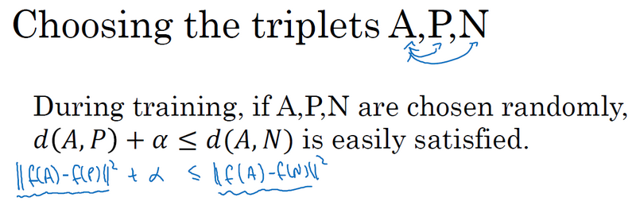

现在我们来看，你如何选择这些三元组来形成训练集。一个问题是如果你从训练集中，随机地选择$A$、$P$和$N$，遵守$A$和$P$是同一个人，而$A$和$N$是不同的人这一原则。有个问题就是，如果随机的选择它们，那么这个约束条件（$d(A,P) + a \leq d(A,N)$）很容易达到，因为随机选择的图片，$A$和$N$比$A$和$P$差别很大的概率很大。我希望你还记得这个符号$d(A,P)$就是前几个幻灯片里写的$|| f(A) - f(P)||^{2}$，$d(A,N)$就是$||f(A) -f(N)||^{2}$，$d(A,P) + a \leq d(A,N)$即$|| f( A) - f( P)||^{2} + a \leq|| f(A) - f( N)||^{2}$。但是如果$A$和$N$是随机选择的不同的人，有很大的可能性$||f(A) - f(N)||^{2}$会比左边这项$||f( A) - f(P)||^{2}$大，而且差距远大于$a$，这样网络并不能从中学到什么。

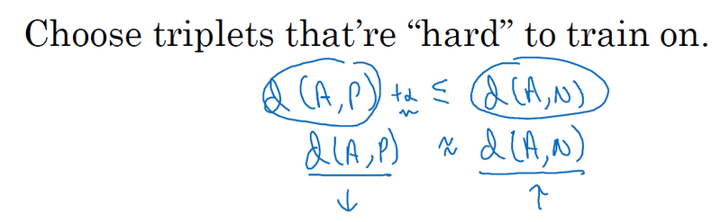

所以为了构建一个数据集，你要做的就是尽可能选择难训练的三元组$A$、$P$和$N$。具体而言，你想要所有的三元组都满足这个条件（$d(A,P) + a \leq d(A,N)$），难训练的三元组就是，你的$A$、$P$和$N$的选择使得$d(A,P)$很接近$d(A,N)$，即$d(A,P) \approx d(A,N)$，这样你的学习算法会竭尽全力使右边这个式子变大（$d(A,N)$），或者使左边这个式子（$d(A,P)$）变小，这样左右两边至少有一个$a$的间隔。并且选择这样的三元组还可以增加你的学习算法的计算效率，如果随机的选择这些三元组，其中有太多会很简单，梯度算法不会有什么效果，因为网络总是很轻松就能得到正确的结果，只有选择难的三元组梯度下降法才能发挥作用，使得这两边离得尽可能远。

如果你对此感兴趣的话，这篇论文中有更多细节，作者是**Florian Schroff**, **Dmitry Kalenichenko**, **James Philbin**，他们建立了这个叫做**FaceNet**的系统，我视频里许多的观点都是来自于他们的工作。

•  **Florian Schroff, Dmitry Kalenichenko, James Philbin (2015).** [FaceNet: A Unified Embedding forFace Recognition and Clustering](https://arxiv.org/pdf/1503.03832.pdf)

顺便说一下，这有一个有趣的事实，关于在深度学习领域，算法是如何命名的。如果你研究一个特定的领域，假如说“某某”领域，通常会将系统命名为“某某”网络或者深度“某某”，我们一直讨论人脸识别，所以这篇论文叫做**FaceNet**(人脸网络)，上个视频里你看到过**DeepFace**(深度人脸)。“某某”网络或者深度“某某”，是深度学习领域流行的命名算法的方式，你可以看一下这篇论文，如果你想要了解更多的关于通过选择最有用的三元组训练来加速算法的细节，这是一个很棒的论文。

总结一下，训练这个三元组损失你需要取你的训练集，然后把它做成很多三元组，这就是一个三元组（编号1），有一个**Anchor**图片和**Positive**图片，这两个（**Anchor**和**Positive**）是同一个人，还有一张另一个人的**Negative**图片。这是另一组（编号2），其中**Anchor**和**Positive**图片是同一个人，但是**Anchor**和**Negative**不是同一个人，等等。

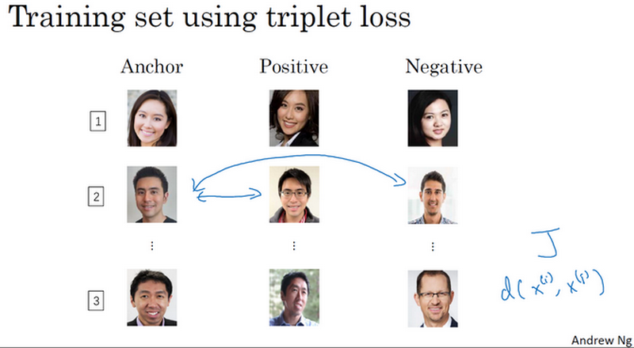

定义了这些包括$A$、$P$和$N$图片的数据集之后，你还需要做的就是用梯度下降最小化我们之前定义的代价函数$J$，这样做的效果就是反向传播到网络中的所有参数来学习到一种编码，使得如果两个图片是同一个人，那么它们的$d$就会很小，如果两个图片不是同一个人，它们的$d$ 就会很大。

这就是三元组损失，并且如何用它来训练网络输出一个好的编码用于人脸识别。现在的人脸识别系统，尤其是大规模的商业人脸识别系统都是在很大的数据集上训练，超过百万图片的数据集并不罕见，一些公司用千万级的图片，还有一些用上亿的图片来训练这些系统。这些是很大的数据集，即使按照现在的标准，这些数据集并不容易获得。幸运的是，一些公司已经训练了这些大型的网络并且上传了模型参数。所以相比于从头训练这些网络，在这一领域，由于这些数据集太大，这一领域的一个实用操作就是下载别人的预训练模型，而不是一切都要从头开始。但是即使你下载了别人的预训练模型，我认为了解怎么训练这些算法也是有用的，以防针对一些应用你需要从头实现这些想法。

这就是三元组损失，下个视频中，我会给你展示**Siamese**网络的一些其他变体，以及如何训练这些网络，让我们进入下个视频吧。

### 4.5 人脸验证与二分类（Face verification and binary classification）

**Triplet loss**是一个学习人脸识别卷积网络参数的好方法，还有其他学习参数的方法，让我们看看如何将人脸识别当成一个二分类问题。

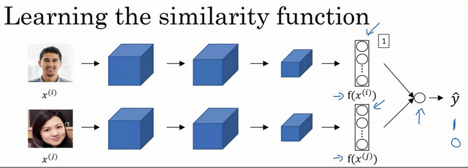

另一个训练神经网络的方法是选取一对神经网络，选取**Siamese**网络，使其同时计算这些嵌入，比如说128维的嵌入（编号1），或者更高维，然后将其输入到逻辑回归单元，然后进行预测，如果是相同的人，那么输出是1，若是不同的人，输出是0。这就把人脸识别问题转换为一个二分类问题，训练这种系统时可以替换**Triplet loss**的方法。

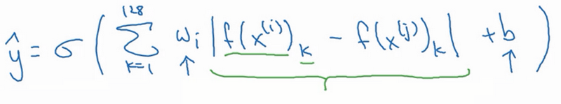

最后的逻辑回归单元是怎么处理的？输出$\hat y$会变成，比如说**sigmoid**函数应用到某些特征上，相比起直接放入这些编码（$f(x^{(i)}),f( x^{(j)})$），你可以利用编码之间的不同。

$\hat y = \sigma(\sum_{k = 1}^{128}{w_{i}| f( x^{( i)})_{k} - f( x^{( j)})_{k}| + b})$

我解释一下，符号$f( x^{( i)})_{k}$代表图片$x^{(i)}$的编码，下标$k$代表选择这个向量中的第$k$个元素，$| f(x^{( i)})_{k} - f( x^{( j)})_{k}|$对这两个编码取元素差的绝对值。你可能想，把这128个元素当作特征，然后把他们放入逻辑回归中，最后的逻辑回归可以增加参数$w_{i}$和$b$，就像普通的逻辑回归一样。你将在这128个单元上训练合适的权重，用来预测两张图片是否是一个人，这是一个很合理的方法来学习预测0或者1，即是否是同一个人。

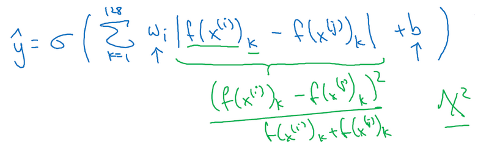

还有其他不同的形式来计算绿色标记的这部分公式（$| f( x^{( i)})_{k} - f( x^{( j)})_{k}|$），比如说，公式可以是$\frac{(f( x^{( i)})_{k} - f(x^{( j)})_{k})^{2}}{f(x^{( i)})_{k} + f( x^{( j)})_{k}}$，这个公式也被叫做$\chi^{2}$公式，是一个希腊字母$\chi$，也被称为$\chi$平方相似度。

•      **Yaniv Taigman, Ming Yang, Marc'Aurelio Ranzato, Lior Wolf (2014).** [DeepFace:Closing the gap to human-level performance in face verification](https://research.fb.com/wp-content/uploads/2016/11/deepface-closing-the-gap-to-human-level-performance-in-face-verification.pdf)

这些公式及其变形在这篇**DeepFace**论文中有讨论，我之前也引用过。

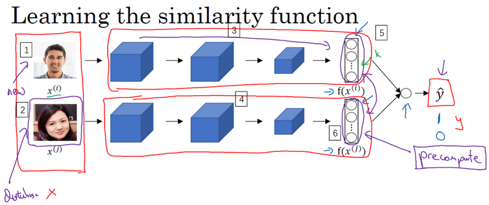

但是在这个学习公式中，输入是一对图片，这是你的训练输入$x$（编号1、2），输出$y$是0或者1，取决于你的输入是相似图片还是非相似图片。与之前类似，你正在训练一个**Siamese**网络，意味着上面这个神经网络拥有的参数和下面神经网络的相同（编号3和4所示的网络），两组参数是绑定的，这样的系统效果很好。

之前提到一个计算技巧可以帮你显著提高部署效果，如果这是一张新图片（编号1），当员工走进门时，希望门可以自动为他们打开，这个（编号2）是在数据库中的图片，不需要每次都计算这些特征（编号6），不需要每次都计算这个嵌入，你可以提前计算好，那么当一个新员工走近时，你可以使用上方的卷积网络来计算这些编码（编号5），然后使用它，和预先计算好的编码进行比较，然后输出预测值$\hat y$。

因为不需要存储原始图像，如果你有一个很大的员工数据库，你不需要为每个员工每次都计算这些编码。这个预先计算的思想，可以节省大量的计算，这个预训练的工作可以用在**Siamese**网路结构中，将人脸识别当作一个二分类问题，也可以用在学习和使用**Triplet loss**函数上，我在之前的视频中描述过。

总结一下，把人脸验证当作一个监督学习，创建一个只有成对图片的训练集，不是三个一组，而是成对的图片，目标标签是1表示一对图片是一个人，目标标签是0表示图片中是不同的人。利用不同的成对图片，使用反向传播算法去训练神经网络，训练**Siamese**神经网络。

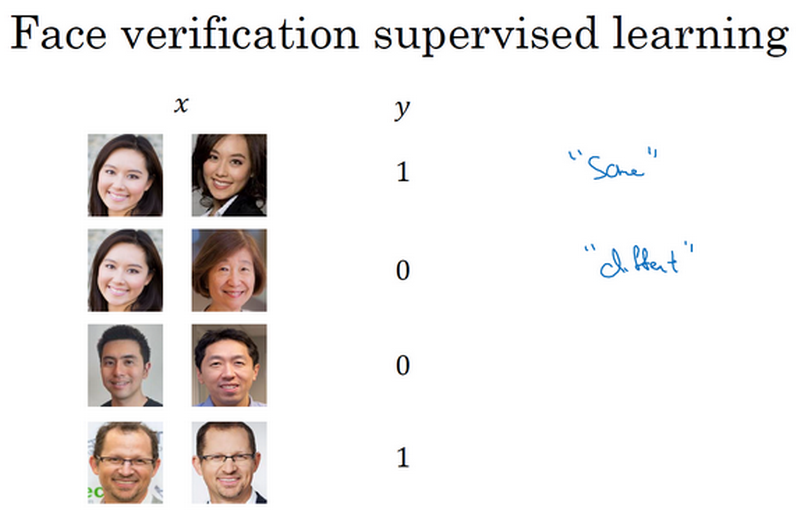

这个你看到的版本，处理人脸验证和人脸识别扩展为二分类问题，这样的效果也很好。我希望你知道，在一次学习时，你需要什么来训练人脸验证，或者人脸识别系统。

### 4.6 什么是神经风格迁移？（What is neural style transfer?）

最近，卷积神经网络最有趣的应用是神经风格迁移，在编程作业中，你将自己实现这部分并创造出你的艺术作品。

什么是神经风格迁移？让我们来看几个例子，比如这张照片，照片是在斯坦福大学拍摄的，离我的办公室不远，你想利用右边照片的风格来重新创造原本的照片，右边的是梵高的星空，神经风格迁移可以帮你生成下面这张照片。

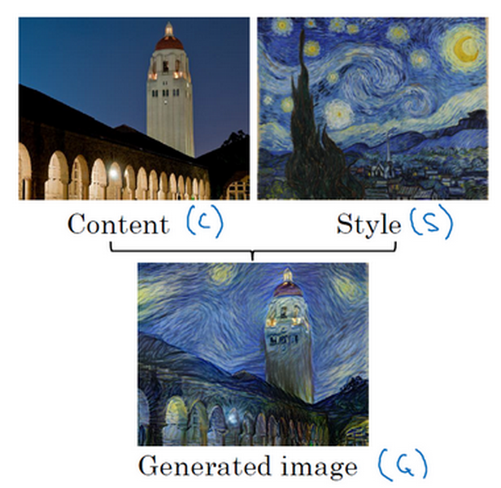

这仍是斯坦福大学的照片，但是用右边图像的风格画出来。

为了描述如何实现神经网络迁移，我将使用$C$来表示内容图像，$S$表示风格图像，$G$表示生成的图像。

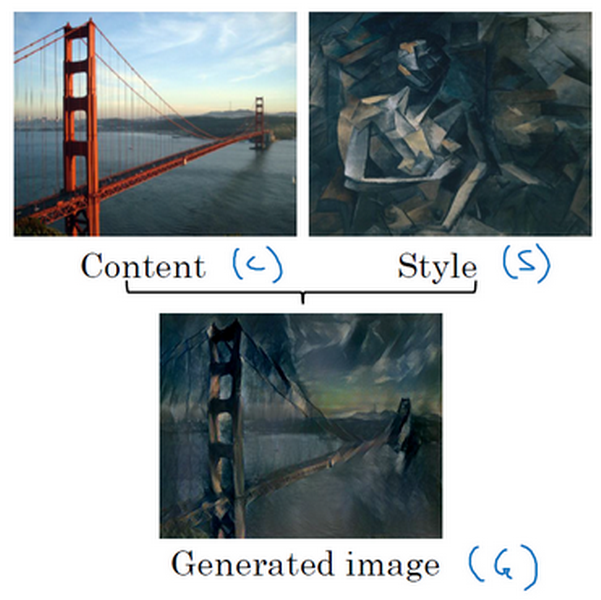

另一个例子，比如，这张图片，$C$代表在旧金山的金门大桥，还有这张风格图片，是毕加索的风格，然后把两张照片结合起来，得到G这张毕加索风格的的金门大桥。

这页中展示的例子，是由**Justin Johnson**制作，在下面几个视频中你将学到如何自己生成这样的图片。

为了实现神经风格迁移，你需要知道卷积网络提取的特征，在不同的神经网络，深层的、浅层的。在深入了解如何实现神经风格迁移之前，我将在下一个视频中直观地介绍卷积神经网络不同层之间的具体运算，让我们来看下一个视频。

### 4.7 CNN特征可视化（What are deep ConvNets learning?）

深度卷积网络到底在学什么？在这个视频中我将展示一些可视化的例子，可以帮助你理解卷积网络中深度较大的层真正在做什么，这样有助于理解如何实现神经风格迁移。

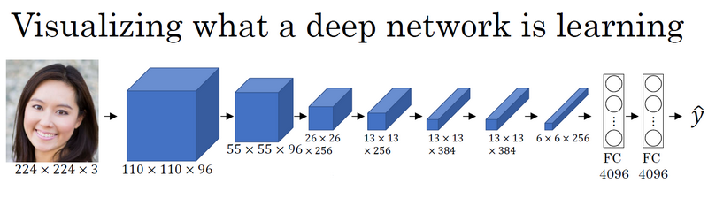

来看一个例子，假如你训练了一个卷积神经网络，是一个**Alexnet**，轻量级网络，你希望将看到不同层之间隐藏单元的计算结果。

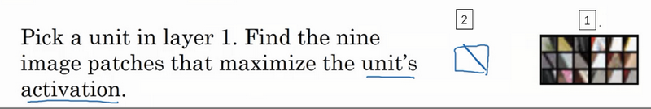

你可以这样做，从第一层的隐藏单元开始，假设你遍历了训练集，然后找到那些使得单元激活最大化的一些图片，或者是图片块。换句话说，将你的训练集经过神经网络，然后弄明白哪一张图片最大限度地激活特定的单元。注意在第一层的隐藏单元，只能看到小部分卷积神经，如果要画出来哪些激活了激活单元，只有一小块图片块是有意义的，因为这就是特定单元所能看到的全部。你选择一个隐藏单元，发现有9个图片最大化了单元激活，你可能找到这样的9个图片块（编号1），似乎是图片浅层区域显示了隐藏单元所看到的，找到了像这样的边缘或者线（编号2），这就是那9个最大化地激活了隐藏单元激活项的图片块。

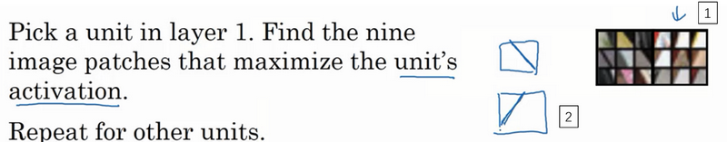

然后你可以选一个另一个第一层的隐藏单元，重复刚才的步骤，这是另一个隐藏单元，似乎第二个由这9个图片块（编号1）组成。看来这个隐藏单元在输入区域，寻找这样的线条（编号2），我们也称之为接受域。

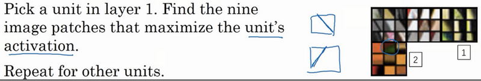

对其他隐藏单元也进行处理，会发现其他隐藏单元趋向于激活类似于这样的图片。这个似乎对垂直明亮边缘左边有绿色的图片块（编号1）感兴趣，这一个隐藏单元倾向于橘色，这是一个有趣的图片块（编号2），红色和绿色混合成褐色或者棕橙色，但是神经元仍可以激活它。

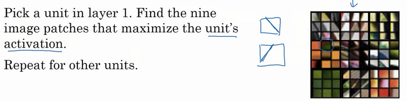

以此类推，这是9个不同的代表性神经元，每一个不同的图片块都最大化地激活了。你可以这样理解，第一层的隐藏单元通常会找一些简单的特征，比如说边缘或者颜色阴影。

我在这个视频中使用的所有例子来自于**Matthew Zener**和**Rob Fergus**的这篇论文，题目是（**Zeiler M D, Fergus R.Visualizing and Understanding Convolutional Networks[J]. 2013, 8689:818-833.**）《可视化理解卷积神经网络》，我会使用一种更简单的方法来可视化神经网络隐藏单元的计算内容。如果你读过他们的论文，他们提出了一些更复杂的方式来可视化卷积神经网络的计算。

你已经在第一层的9个隐藏单元重复了这个过程好几遍，如果在深层的隐藏单元中进行这样的计算呢？卷积神经网络的深层部分学到了什么？在深层部分，一个隐藏单元会看到一张图片更大的部分，在极端的情况下，可以假设每一个像素都会影响到神经网络更深层的输出，靠后的隐藏单元可以看到更大的图片块，我还会画出和这页中的大小相同的图片块。

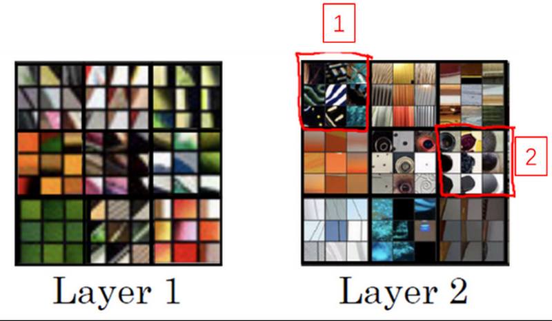

但如果我们重复这一过程，这（**Layer 1**所示图片）是之前第一层得到的，这个（**Layer 2**所示图片）是可视化的第2层中最大程度激活的9个隐藏单元。我想解释一下这个可视化，这是（编号2所示）使一个隐藏单元最大激活的9个图片块，每一个组合，这是另一组（编号2），使得一个隐藏单元被激活的9个图片块，这个可视化展示了第二层的9个隐藏单元，每一个又有9个图片块使得隐藏单元有较大的输出或是较大的激活。

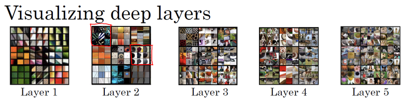

在更深的层上，你可以重复这个过程。

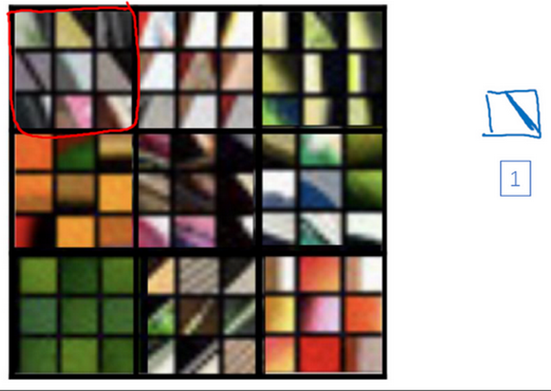

在这页里很难看清楚，这些微小的浅层图片块，让我们放大一些，这是第一层，这是第一个被高度激活的单元，你能在输入图片的区域看到，大概是这个角度的边缘（编号1）放大第二层的可视化图像。

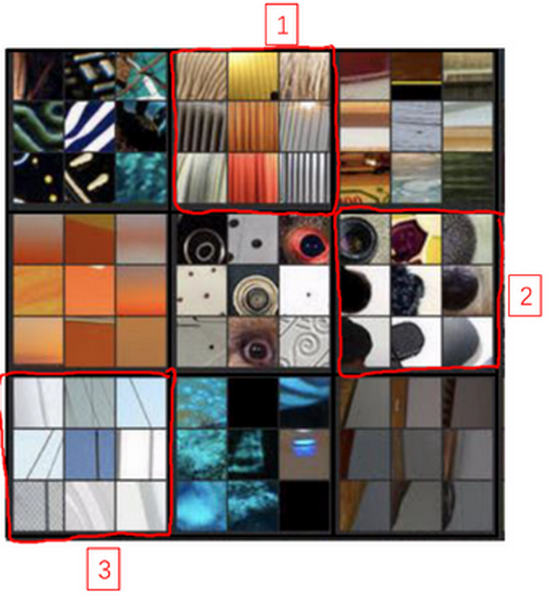

有意思了，第二层似乎检测到更复杂的形状和模式，比如说这个隐藏单元（编号1），它会找到有很多垂线的垂直图案，这个隐藏单元（编号2）似乎在左侧有圆形图案时会被高度激活，这个的特征（编号3）是很细的垂线，以此类推，第二层检测的特征变得更加复杂。

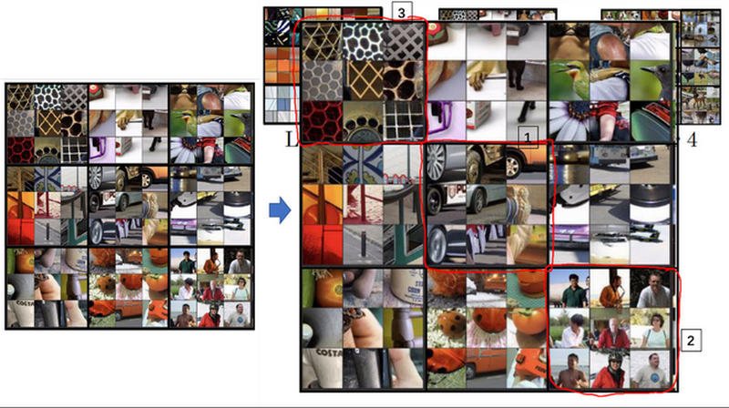

看看第三层我们将其放大，放得更大一点，看得更清楚一点，这些东西激活了第三层。再放大一点，这又很有趣了，这个隐藏单元（编号1）似乎对图像左下角的圆形很敏感，所以检测到很多车。这一个（编号2）似乎开始检测到人类，这个（编号3）似乎检测特定的图案，蜂窝形状或者方形，类似这样规律的图案。有些很难看出来，需要手动弄明白检测到什么，但是第三层明显，检测到更复杂的模式。

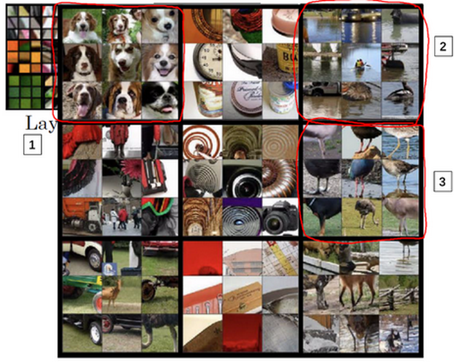

下一层呢？这是第四层，检测到的模式和特征更加复杂，这个（编号1）学习成了一个狗的检测器，但是这些狗看起来都很类似，我并不知道这些狗的种类，但是你知道这些都是狗，他们看起来也类似。第四层中的这个（编号2）隐藏单元它检测什么？水吗？这个（编号3）似乎检测到鸟的脚等等。

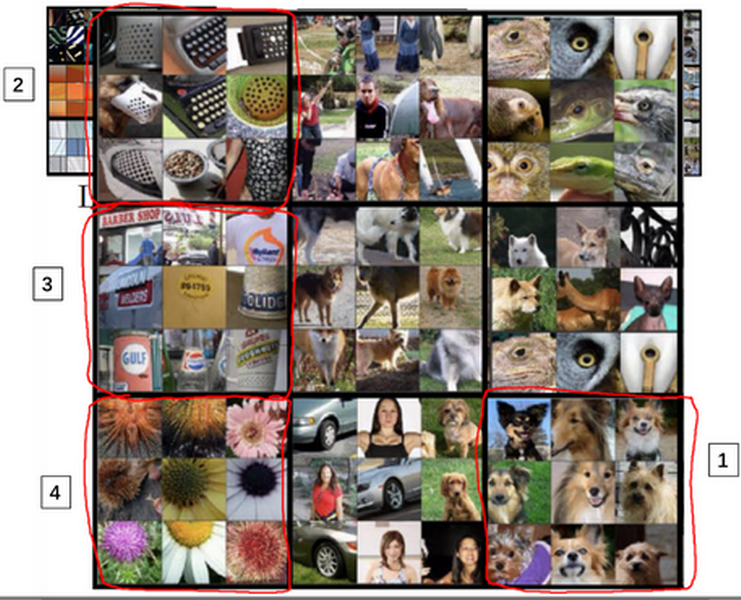

第五层检测到更加复杂的事物，注意到这（编号1）也有一个神经元，似乎是一个狗检测器，但是可以检测到的狗似乎更加多样性。这个（编号2）可以检测到键盘，或者是键盘质地的物体，可能是有很多点的物体。我认为这个神经元（编号3）可能检测到文本，但是很难确定，这个（编号4）检测到花。我们已经有了一些进展，从检测简单的事物，比如说，第一层的边缘，第二层的质地，到深层的复杂物体。

我希望这让你可以更直观地了解卷积神经网络的浅层和深层是如何计算的，接下来让我们使用这些知识开始构造神经风格迁移算法。

### 4.8 代价函数（Cost function）

要构建一个神经风格迁移系统，让我们为生成的图像定义一个代价函数，你接下看到的是，通过最小化代价函数，你可以生成你想要的任何图像。

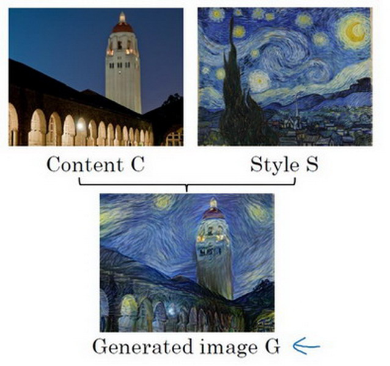

记住我们的问题，给你一个内容图像$C$，给定一个风格图片$S$，而你的目标是生成一个新图片$G$。为了实现神经风格迁移，你要做的是定义一个关于$G$的代价函数$J$用来评判某个生成图像的好坏，我们将使用梯度下降法去最小化$J(G)$，以便于生成这个图像。

怎么判断生成图像的好坏呢？我们把这个代价函数定义为两个部分。

$J_{\text{content}}(C,G)$

第一部分被称作内容代价，这是一个关于内容图片和生成图片的函数，它是用来度量生成图片$G$的内容与内容图片$C$的内容有多相似。

$J_{\text{style}}(S,G)$

然后我们会把结果加上一个风格代价函数，也就是关于$S$和$G$的函数，用来度量图片$G$的风格和图片$S$的风格的相似度。

$J( G) = a J_{\text{content}}( C,G) + \beta J_{\text{style}}(S,G)$

最后我们用两个超参数$a$和$\beta$来来确定内容代价和风格代价，两者之间的权重用两个超参数来确定。两个代价的权重似乎是多余的，我觉得一个超参数似乎就够了，但提出神经风格迁移的原始作者使用了两个不同的超参数，我准备保持一致。

关于神经风格迁移算法我将在接下来几段视频中展示的，是基于**Leon Gatys**， **Alexandra Ecker**和**Matthias Bethge**的这篇论文。这篇论文并不是很难读懂，如果你愿意，看完这些视频，我也非常推荐你去看看他们的论文。

**Leon A. Gatys, Alexander S. Ecker, Matthias Bethge, (2015). A Neural Algorithm of Artistic Style** (<https://arxiv.org/abs/1508.06576>)

算法的运行是这样的，对于代价函数$J(G)$，为了生成一个新图像，你接下来要做的是随机初始化生成图像$G$，它可能是100×100×3，可能是500×500×3，又或者是任何你想要的尺寸。

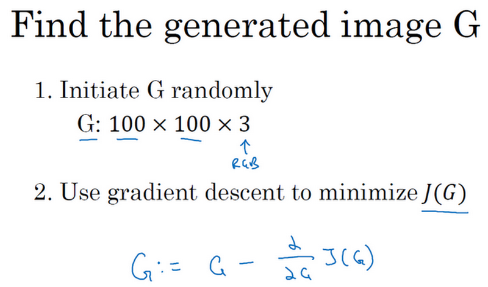

然后使用在之前的幻灯片上定义的代价函数$J(G)$，你现在可以做的是使用梯度下降的方法将其最小化，更新$G:= G - \frac{\partial}{\partial G}J(G)$。在这个步骤中，你实际上更新的是图像$G$的像素值，也就是100×100×3，比如**RGB**通道的图片。

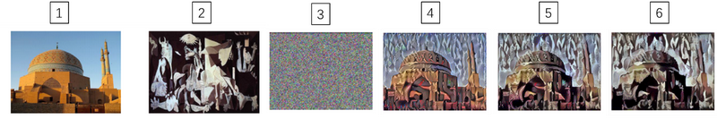

这里有个例子，假设你从这张内容图片（编号1）和风格（编号2）图片开始，这是另一张公开的毕加索画作，当你随机初始化$G$，你随机初始化的生成图像就是这张随机选取像素的白噪声图（编号3）。接下来运行梯度下降算法，最小化代价函数$J(G)$，逐步处理像素，这样慢慢得到一个生成图片（编号4、5、6），越来越像用风格图片的风格画出来的内容图片。

在这段视频中你看到了神经风格迁移算法的概要，定义一个生成图片$G$的代价函数，并将其最小化。接下来我们需要了解怎么去定义内容代价函数和风格代价函数，让我们从下一个视频开始学习这部分内容吧。

### 4.9 内容代价函数（Content cost function）

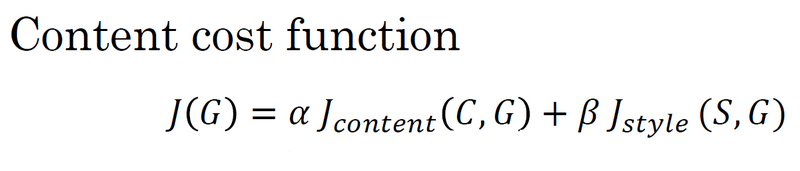

风格迁移网络的代价函数有一个内容代价部分，还有一个风格代价部分。

$J( G) = \alpha J_{\text{content}}( C,G) + \beta J_{\text{style}}(S,G)$

我们先定义内容代价部分，不要忘了这就是我们整个风格迁移网络的代价函数，我们看看内容代价函数应该是什么。

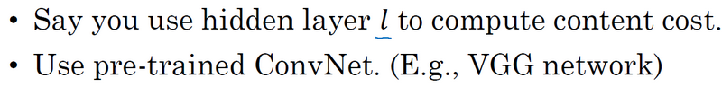

假如说，你用隐含层$l$来计算内容代价，如果$l$是个很小的数，比如用隐含层1，这个代价函数就会使你的生成图片像素上非常接近你的内容图片。然而如果你用很深的层，那么那就会问，内容图片里是否有狗，然后它就会确保生成图片里有一个狗。所以在实际中，这个层$l$在网络中既不会选的太浅也不会选的太深。因为你要自己做这周结束的编程练习，我会让你获得一些直觉，在编程练习中的具体例子里通常$l$会选择在网络的中间层，既不太浅也不很深，然后用一个预训练的卷积模型，可以是**VGG网络**或者其他的网络也可以。

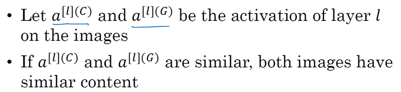

现在你需要衡量假如有一个内容图片和一个生成图片他们在内容上的相似度，我们令这个$a^{[l][C]}$和$a^{[l][G]}$，代表这两个图片$C$和$G$的$l$层的激活函数值。如果这两个激活值相似，那么就意味着两个图片的内容相似。

我们定义这个

$J_{\text{content}}( C,G) = \frac{1}{2}|| a^{[l][C]} - a^{[l][G]}||^{2}$

为两个激活值不同或者相似的程度，我们取$l$层的隐含单元的激活值，按元素相减，内容图片的激活值与生成图片相比较，然后取平方，也可以在前面加上归一化或者不加，比如$\frac{1}{2}$或者其他的，都影响不大,因为这都可以由这个超参数$a$来调整（$J(G) =a J_{\text{content}}( C,G) + \beta J_{\text{style}}(S,G)$）。

要清楚我这里用的符号都是展成向量形式的，这个就变成了这一项（$a^{[l]\lbrack C\rbrack}$）减这一项（$a^{[l]\lbrack C\rbrack}$）的$L2$范数的平方，在把他们展成向量后。这就是两个激活值间的差值平方和，这就是两个图片之间$l$层激活值差值的平方和。后面如果对$J(G)$做梯度下降来找$G$的值时，整个代价函数会激励这个算法来找到图像$G$，使得隐含层的激活值和你内容图像的相似。

这就是如何定义风格迁移网络的内容代价函数，接下来让我们学习风格代价函数。

### 4.10 风格代价函数（Style cost function）

在上节视频中，我们学习了如何为神经风格迁移定义内容代价函数，这节课我们来了解风格代价函数。那么图片的风格到底是什么意思呢？

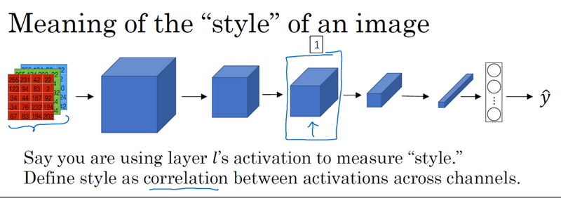

这么说吧，比如你有这样一张图片，你可能已经对这个计算很熟悉了，它能算出这里是否含有不同隐藏层。现在你选择了某一层$l$（编号1），比如这一层去为图片的风格定义一个深度测量，现在我们要做的就是将图片的风格定义为$l$层中各个通道之间激活项的相关系数。

我来详细解释一下，现在你将$l$层的激活项取出，这是个$ n_{H} \times n_{W} \times n_{C}$的激活项，它是一个三维的数据块。现在问题来了，如何知道这些不同通道之间激活项的相关系数呢？

为了解释这些听起来很含糊不清的词语，现在注意这个激活块，我把它的不同通道渲染成不同的颜色。在这个例子中，假如我们有5个通道为了方便讲解，我将它们染成了五种颜色。一般情况下，我们在神经网络中会有许多通道，但这里只用5个通道，会更方便我们理解。

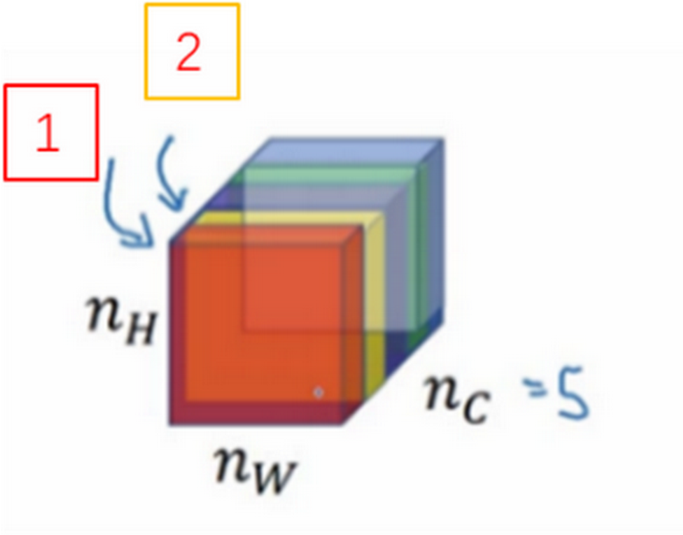

为了能捕捉图片的风格，你需要进行下面这些操作，首先，先看前两个通道，前两个通道（编号1、2）分别是图中的红色和黄色部分，那我们该如何计算这两个通道间激活项的相关系数呢？

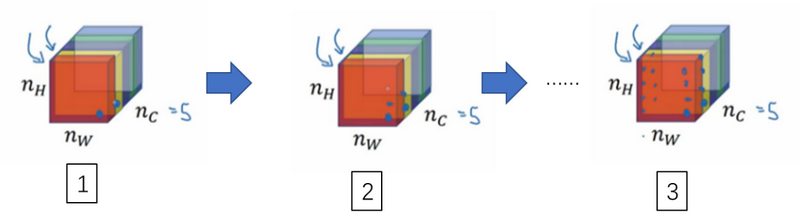

举个例子，在视频的左下角在第一个通道中含有某个激活项，第二个通道也含有某个激活项，于是它们组成了一对数字（编号1所示）。然后我们再看看这个激活项块中其他位置的激活项，它们也分别组成了很多对数字（编号2，3所示），分别来自第一个通道，也就是红色通道和第二个通道，也就是黄色通道。现在我们得到了很多个数字对，当我们取得这两个$n_{H}\times n_{W}$的通道中所有的数字对后，现在该如何计算它们的相关系数呢？它是如何决定图片风格的呢？

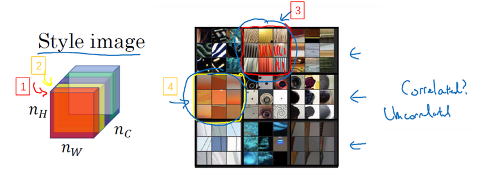

我们来看一个例子，这是之前视频中的一个可视化例子，它来自一篇论文，作者是**Matthew Zeile**和**Rob Fergus** 我之前有提到过。我们知道，这个红色的通道（编号1）对应的是这个神经元，它能找出图片中的特定位置是否含有这些垂直的纹理（编号3），而第二个通道也就是黄色的通道（编号2），对应这个神经元（编号4），它可以粗略地找出橙色的区域。什么时候两个通道拥有高度相关性呢？如果它们有高度相关性，那么这幅图片中出现垂直纹理的地方（编号2），那么这块地方（编号4）很大概率是橙色的。如果说它们是不相关的，又是什么意思呢？显然，这意味着图片中有垂直纹理的地方很大概率不是橙色的。而相关系数描述的就是当图片某处出现这种垂直纹理时，该处又同时是橙色的可能性。

相关系数这个概念为你提供了一种去测量这些不同的特征的方法，比如这些垂直纹理，这些橙色或是其他的特征去测量它们在图片中的各个位置同时出现或不同时出现的频率。

如果我们在通道之间使用相关系数来描述通道的风格，你能做的就是测量你的生成图像中第一个通道（编号1）是否与第二个通道（编号2）相关，通过测量，你能得知在生成的图像中垂直纹理和橙色同时出现或者不同时出现的频率，这样你将能够测量生成的图像的风格与输入的风格图像的相似程度。

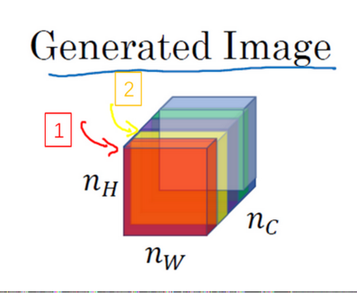

现在我们来证实这种说法，对于这两个图像，也就是风格图像与生成图像，你需要计算一个风格矩阵，说得更具体一点就是用$l$层来测量风格。

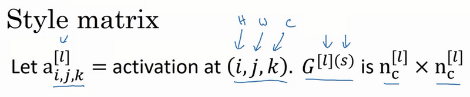

我们设$a_{i,\ j,\ k}^{[l]}$，设它为隐藏层l中$(i,j,k)$位置的激活项，$i$，$j$，$k$分别代表该位置的高度、宽度以及对应的通道数。现在你要做的就是去计算一个关于$l$层和风格图像的矩阵，即$G^{[l](S)}$（$l$表示层数，$S$表示风格图像），这（$G^{[l]( S)}$）是一个$n_{c} \times n_{c}$的矩阵，同样地，我们也对生成的图像进行这个操作。

但是现在我们先来定义风格图像，设这个关于$l$层和风格图像的，$G$是一个矩阵，这个矩阵的高度和宽度都是$l$层的通道数。在这个矩阵中$k$和$k'$元素被用来描述$k$通道和$k'$通道之间的相关系数。具体地：

$G_{kk^{'}}^{[l]( S)} = \sum_{i = 1}^{n_{H}^{[l]}}{\sum_{j = 1}^{n_{W}^{[l]}}{a_{i,\ j,\ k}^{[l](S)}a_{i,\ j,\ k^{'}}^{[l](S)}}}$

用符号$i$，$j$表示下界，对$i$，$j$，$k$位置的激活项$a_{i,\ j,\ k}^{[l]}$，乘以同样位置的激活项，也就是$i$,$ j$,$k'$位置的激活项，即$a_{i,j,k^{'}}^{[l]}$，将它们两个相乘。然后$i$和$j$分别加到l层的高度和宽度，即$n_{H}^{[l]}$和$n_{W}^{[l]}$，将这些不同位置的激活项都加起来。$(i,j,k)$和$(i,j,k')$中$x$坐标和$y$坐标分别对应高度和宽度，将$k$通道和$k'$通道上这些位置的激活项都进行相乘。我一直以来用的这个公式，严格来说，它是一种非标准的互相关函数，因为我们没有减去平均数，而是将它们直接相乘。

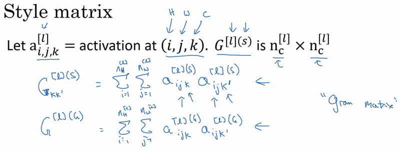

这就是输入的风格图像所构成的风格矩阵，然后，我们再对生成图像做同样的操作。

$G_{kk^{'}}^{[l]( G)} = \sum_{i = 1}^{n_{H}^{[l]}}{\sum_{j = 1}^{n_{W}^{[l]}}{a_{i,\ j,\ k}^{[l](G)}a_{i,\ j,\ k^{'}}^{[l](G)}}}$

$a_{i,\ j,\ k}^{[l](S)}$和$a_{i, j,k}^{[l](G)}$中的上标$(S)$和$(G)$分别表示在风格图像$S$中的激活项和在生成图像$G$的激活项。我们之所以用大写字母$G$来代表这些风格矩阵，是因为在线性代数中这种矩阵有时也叫**Gram**矩阵，但在这里我只把它们叫做风格矩阵。

所以你要做的就是计算出这张图像的风格矩阵，以便能够测量出刚才所说的这些相关系数。更正规地来表示，我们用$a_{i,j,k}^{[l]}$来记录相应位置的激活项，也就是$l$层中的$i,j,k$位置，所以$i$代表高度，$j$代表宽度，$k$代表着$l$中的不同通道。之前说过，我们有5个通道，所以$k$就代表这五个不同的通道。

对于这个风格矩阵，你要做的就是计算这个矩阵也就是$G^{[l]}$矩阵，它是个$n_{c} \times n_{c}$的矩阵，也就是一个方阵。记住，因为这里有$n_{c}$个通道，所以矩阵的大小是$n_{c}\times n_{c}$。以便计算每一对激活项的相关系数，所以$G_{\text{kk}^{'}}^{[l]}$可以用来测量$k$通道与$k'$通道中的激活项之间的相关系数，$k$和$k'$会在1到$n_{c}$之间取值，$n_{c}$就是$l$层中通道的总数量。

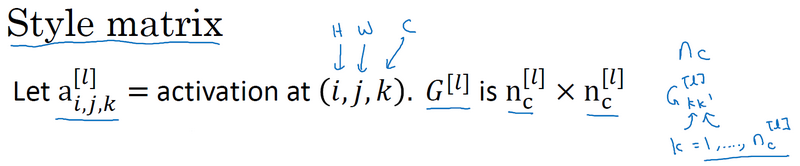

当在计算$G^{[l]}$时，我写下的这个符号（下标$kk’$）只代表一种元素，所以我要在右下角标明是$kk'$元素，和之前一样$i$，$j$从一开始往上加，对应$(i,j,k)$位置的激活项与对应$(i, j, k')$位置的激活项相乘。记住，这个$i$和$j$是激活块中对应位置的坐标，也就是该激活项所在的高和宽，所以$i$会从1加到$n_{H}^{[l]}$，$j$会从1加到$n_{W}^{[l]}$，$k$和$k'$则表示对应的通道，所以$k$和$k'$值的范围是从1开始到这个神经网络中该层的通道数量$n_{C}^{[l]}$。这个式子就是把图中各个高度和宽度的激活项都遍历一遍，并将$k$和$k'$通道中对应位置的激活项都进行相乘，这就是$G_{{kk}^{'}}^{[l]}$的定义。通过对$k$和$k'$通道中所有的数值进行计算就得到了$G$矩阵，也就是风格矩阵。

$G_{kk^{'}}^{[l]} = \sum_{i = 1}^{n_{H}^{[l]}}{\sum_{j = 1}^{n_{W}^{[l]}}{a_{i,\ j,\ k}^{[l]}a_{i,\ j,\ k^{'}}^{[l]}}}$

要注意，如果两个通道中的激活项数值都很大，那么$G_{{kk}^{'}}^{[l]}$也会变得很大，对应地，如果他们不相关那么$G_{{kk}^{'}}^{[l]}$就会很小。严格来讲，我一直使用这个公式来表达直觉想法，但它其实是一种非标准的互协方差，因为我们并没有减去均值而只是把这些元素直接相乘，这就是计算图像风格的方法。

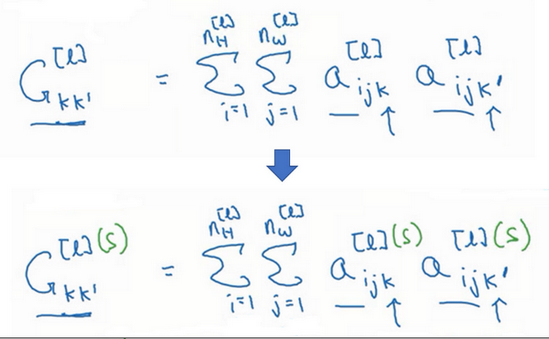

$G_{kk^{'}}^{[l]( S)} = \sum_{i = 1}^{n_{H}^{[l]}}{\sum_{j = 1}^{n_{W}^{[l]}}{a_{i,\ j,\ k}^{[l](S)}a_{i,\ j,\ k^{'}}^{[l](S)}}}$

你要同时对风格图像$S$和生成图像$G$都进行这个运算，为了区分它们，我们在它的右上角加一个$(S)$，表明它是风格图像$S$，这些都是风格图像S中的激活项，之后你需要对生成图像也做相同的运算。

$G_{kk^{'}}^{[l]( G)} = \sum_{i = 1}^{n_{H}^{[l]}}{\sum_{j = 1}^{n_{W}^{[l]}}{a_{i,\ j,\ k}^{[l](G)}a_{i,\ j,\ k^{'}}^{[l](G)}}}$

和之前一样，再把公式都写一遍，把这些都加起来，为了区分它是生成图像，在这里放一个$(G)$。

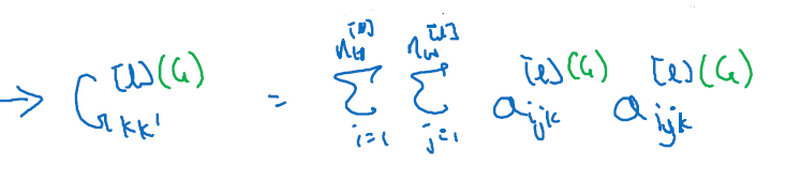

现在，我们有2个矩阵，分别从风格图像$S$和生成图像$G$。

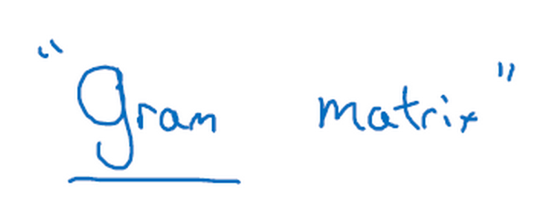

再提醒一下，我们一直使用大写字母$G$来表示矩阵，是因为在线性代数中，这种矩阵被称为**Gram**矩阵，但在本视频中我把它叫做风格矩阵，我们取了**Gram**矩阵的首字母$G$来表示这些风格矩阵。

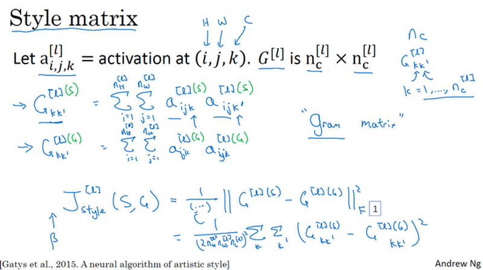

最后，如果我们将$S$和$G$代入到风格代价函数中去计算，这将得到这两个矩阵之间的误差，因为它们是矩阵，所以在这里加一个$F$（**Frobenius**范数，编号1所示），这实际上是计算两个矩阵对应元素相减的平方的和，我们把这个式子展开，从$k$和$k'$开始作它们的差，把对应的式子写下来，然后把得到的结果都加起来，作者在这里使用了一个归一化常数，也就是$\frac{1}{2n_{H}^{[l]l}n_{W}^{[l]}n_{C}^{[l]}}$，再在外面加一个平方，但是一般情况下你不用写这么多，一般我们只要将它乘以一个超参数$\beta$就行。

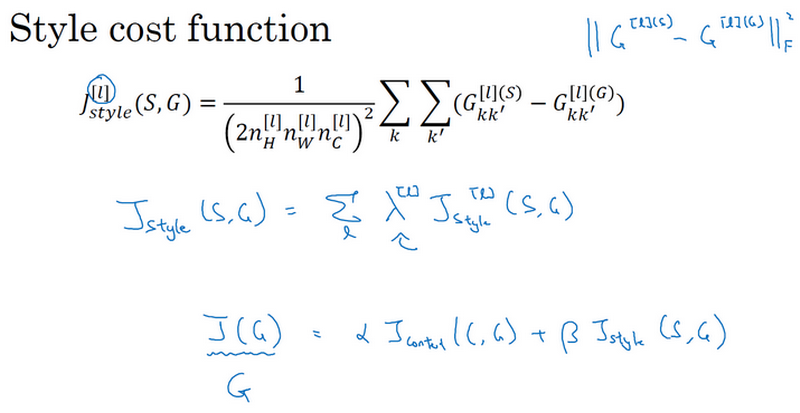

最后，这是对$l$层定义的风格代价函数，和之前你见到的一样，这是两个矩阵间一个基本的**Frobenius**范数，也就是$S$图像和$G$图像之间的范数再乘上一个归一化常数，不过这不是很重要。实际上，如果你对各层都使用风格代价函数，会让结果变得更好。如果要对各层都使用风格代价函数，你可以这么定义代价函数，把各个层的结果（各层的风格代价函数）都加起来，这样就能定义它们全体了。我们还需要对每个层定义权重，也就是一些额外的超参数，我们用$\lambda^{[l]}$来表示，这样将使你能够在神经网络中使用不同的层，包括之前的一些可以测量类似边缘这样的低级特征的层，以及之后的一些能测量高级特征的层，使得我们的神经网络在计算风格时能够同时考虑到这些低级和高级特征的相关系数。这样，在基础的训练中你在定义超参数时，可以尽可能的得到更合理的选择。

为了把这些东西封装起来，你现在可以定义一个全体代价函数：

$J(G) = a J_{\text{content}( C,G)} + \beta J_{{style}}(S,G)$

之后用梯度下降法，或者更复杂的优化算法来找到一个合适的图像$G$，并计算$J(G)$的最小值，这样的话，你将能够得到非常好看的结果，你将能够得到非常漂亮的结果。

这节神经风格迁移的内容就讲到这里，希望你能愉快地在本周的基础训练中进行实践。在本周结束之前，还有最后一节内容想告诉你们，就是如何对**1D**和**3D**的数据进行卷积，之前我们处理的都是**2D**图片，我们下节视频再见。

### 4.11 一维到三维推广（1D and 3D generalizations of models）

你已经学习了许多关于卷积神经网络（**ConvNets**）的知识，从卷积神经网络框架，到如何使用它进行图像识别、对象检测、人脸识别与神经网络转换。即使我们大部分讨论的图像数据，某种意义上而言都是**2D**数据，考虑到图像如此普遍，许多你所掌握的思想不仅局限于**2D**图像，甚至可以延伸至**1D**，乃至**3D**数据。

让我们回头看看在第一周课程中你所学习关于**2D**卷积，你可能会输入一个14×14的图像，并使用一个5×5的过滤器进行卷积，接下来你看到了14×14图像是如何与5×5的过滤器进行卷积的，通过这个操作你会得到10×10的输出。

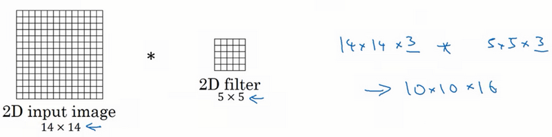

如果你使用了多通道，比如14×14×3，那么相匹配的过滤器可能是5×5×3，如果你使用了多重过滤，比如16，最终你得到的是10×10×16。

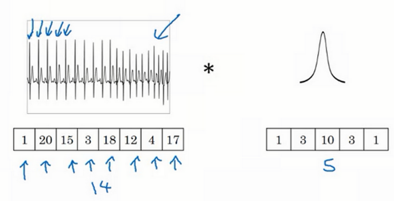

事实证明早期想法也同样可以用于1维数据，举个例子，左边是一个**EKG**信号，或者说是心电图，当你在你的胸部放置一个电极，电极透过胸部测量心跳带来的微弱电流，正因为心脏跳动，产生的微弱电波能被一组电极测量，这就是人心跳产生的**EKG**，每一个峰值都对应着一次心跳。

如果你想使用**EKG**信号，比如医学诊断，那么你将处理1维数据，因为**EKG**数据是由时间序列对应的每个瞬间的电压组成，这次不是一个14×14的尺寸输入，你可能只有一个14尺寸输入，在这种情况下你可能需要使用一个1维过滤进行卷积，你只需要一个1×5的过滤器，而不是一个5×5的。

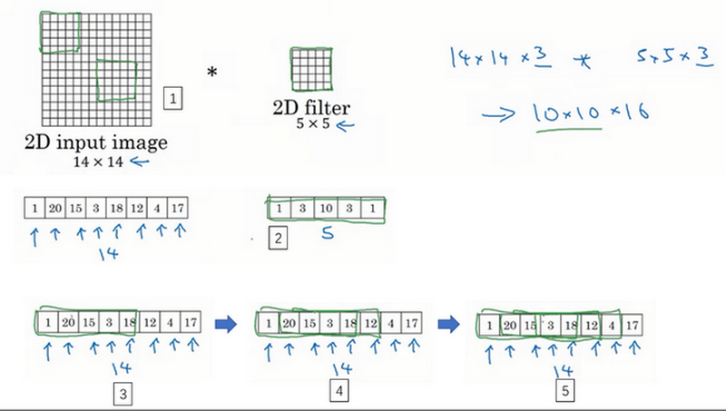

二维数据的卷积是将同一个5×5特征检测器应用于图像中不同的位置（编号1所示），你最后会得到10×10的输出结果。1维过滤器可以取代你的5维过滤器（编号2所示），可在不同的位置中应用类似的方法（编号3，4，5所示）。

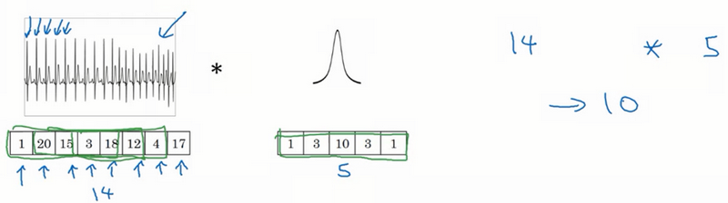

当你对这个1维信号使用卷积，你将发现一个14维的数据与5维数据进行卷积，并产生一个10维输出。

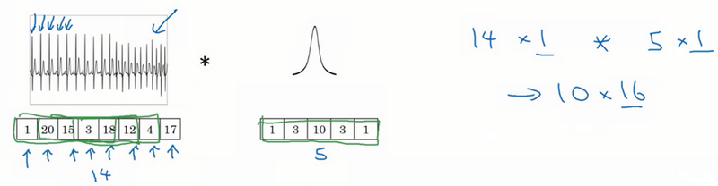

再一次如果你使用多通道，在这种场景下可能会获得一个14×1的通道。如果你使用一个**EKG**，就是5×1的，如果你有16个过滤器，可能你最后会获得一个10×16的数据，这可能会是你卷积网络中的某一层。

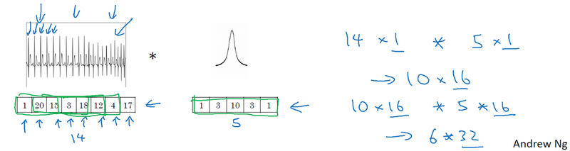

对于卷积网络的下一层，如果输入一个10×16数据，你也可以使用一个5维过滤器进行卷积，这需要16个通道进行匹配，如果你有32个过滤器，另一层的输出结果就是6×32，如果你使用了32个过滤器的话。

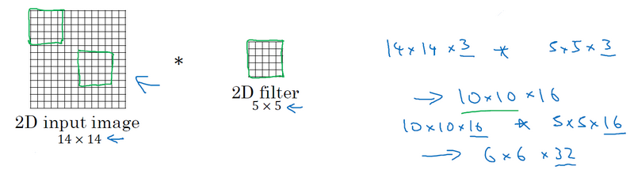

对于2D数据而言，当你处理10×10×16的数据时也是类似的，你可以使用5×5×16进行卷积，其中两个通道数16要相匹配，你将得到一个6×6的输出，如果你用的是32过滤器，输出结果就是6×6×32，这也是32的来源。

所有这些方法也可以应用于1维数据，你可以在不同的位置使用相同的特征检测器，比如说，为了区分**EKG**信号中的心跳的差异，你可以在不同的时间轴位置使用同样的特征来检测心跳。

所以卷积网络同样可以被用于**1D**数据，对于许多1维数据应用，你实际上会使用递归神经网络进行处理，这个网络你会在下一个课程中学到，但是有些人依旧愿意尝试使用卷积网络解决这些问题。

下一门课将讨论序列模型，包括递归神经网络、**LCM**与其他类似模型。我们将探讨使用**1D**卷积网络的优缺点，对比于其它专门为序列数据而精心设计的模型。

这也是**2D**向**1D**的进化，对于3D数据来说如何呢？什么是**3D**数据？与**1D**数列或数字矩阵不同，你现在有了一个**3D**块，一个**3D**输入数据。以你做**CT**扫描为例，这是一种使用**X**光照射，然后输出身体的**3D**模型，**CT**扫描实现的是它可以获取你身体不同片段（图片信息）。

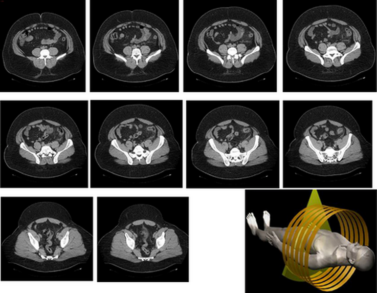

当你进行**CT**扫描时，与我现在做的事情一样，你可以看到人体躯干的不同切片（整理者注：图中所示为人体躯干中不同层的切片，附**CT**扫描示意图，图片源于互联网），本质上这个数据是3维的。

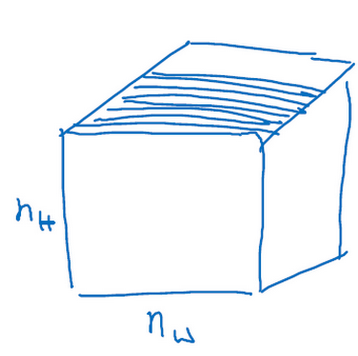

一种对这份数据的理解方式是，假设你的数据现在具备一定长度、宽度与高度，其中每一个切片都与躯干的切片对应。

如果你想要在**3D**扫描或**CT**扫描中应用卷积网络进行特征识别，你也可以从第一张幻灯片（**Convolutions in 2D and 1D**）里得到想法，并将其应用到**3D**卷积中。为了简单起见，如果你有一个**3D**对象，比如说是14×14×14，这也是输入**CT**扫描的宽度与深度（后两个14）。再次提醒，正如图像不是必须以矩形呈现，**3D**对象也不是一定是一个完美立方体，所以长和宽可以不一样，同样**CT**扫描结果的长宽高也可以是不一致的。为了简化讨论，我仅使用14×14×14为例。

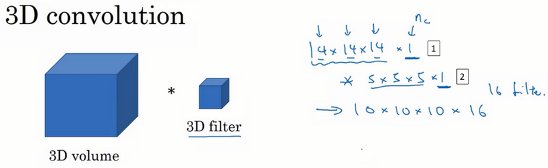

如果你现在使用5×5×5过滤器进行卷积，你的过滤器现在也是**3D**的，这将会给你一个10×10×10的结果输出，技术上来说你也可以再×1（编号1所示），如果这有一个1的通道。这仅仅是一个**3D**模块，但是你的数据可以有不同数目的通道，那种情况下也是乘1（编号2所示），因为通道的数目必须与过滤器匹配。如果你使用16过滤器处理5×5×5×1，接下来的输出将是10×10×10×16，这将成为你**3D**数据卷积网络上的一层。

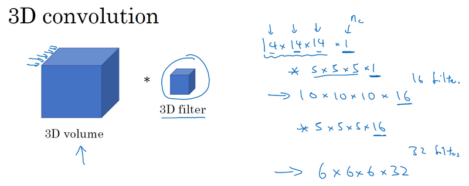

如果下一层卷积使用5×5×5×16维度的过滤器再次卷积，通道数目也与往常一样匹配，如果你有32个过滤器，操作也与之前相同，最终你得到一个6×6×6×32的输出。

某种程度上**3D**数据也可以使用**3D**卷积网络学习，这些过滤器实现的功能正是通过你的3D数据进行特征检测。**CT**医疗扫描是**3D**数据的一个实例，另一个数据处理的例子是你可以将电影中随时间变化的不同视频切片看作是**3D**数据，你可以将这个技术用于检测动作及人物行为。

总而言之这就是**1D**、**2D**及**3D**数据处理，图像数据无处不在，以至于大多数卷积网络都是基于图像上的**2D**数据，但我希望其他模型同样会对你有帮助。

这是本周最后一次视频，也是最后一次关于卷积神经网络的课程，你已经学习了许多关于卷积网络的知识，我希望你能够在未来工作中发现许多思想对你有所裨益，祝贺你完成了这些视频学习，我希望你能喜欢这周的课后练习，接下来关于顺序模型的课程我们不见不散。

**参考文献：**

- Florian Schroff, Dmitry Kalenichenko, James Philbin (2015). [FaceNet: A Unified Embedding for Face Recognition and Clustering](https://arxiv.org/pdf/1503.03832.pdf)
- Yaniv Taigman, Ming Yang, Marc'Aurelio Ranzato, Lior Wolf (2014). [DeepFace: Closing the gap to human-level performance in face verification](https://research.fb.com/wp-content/uploads/2016/11/deepface-closing-the-gap-to-human-level-performance-in-face-verification.pdf)
- The pretrained model we use is inspired by Victor Sy Wang's implementation and was loaded using his code: <https://github.com/iwantooxxoox/Keras-OpenFace>.
- Our implementation also took a lot of inspiration from the official FaceNet github repository: <https://github.com/davidsandberg/facenet>
- Leon A. Gatys, Alexander S. Ecker, Matthias Bethge, (2015). A Neural Algorithm of Artistic Style (<https://arxiv.org/abs/1508.06576>)
- Harish Narayanan, Convolutional neural networks for artistic style transfer. <https://harishnarayanan.org/writing/artistic-style-transfer/>
- Log0, TensorFlow Implementation of "A Neural Algorithm of Artistic Style". <http://www.chioka.in/tensorflow-implementation-neural-algorithm-of-artistic-style>
- Karen Simonyan and Andrew Zisserman (2015). Very deep convolutional networks for large-scale image recognition (<https://arxiv.org/pdf/1409.1556.pdf>)
- MatConvNet. <http://www.vlfeat.org/matconvnet/pretrained/>