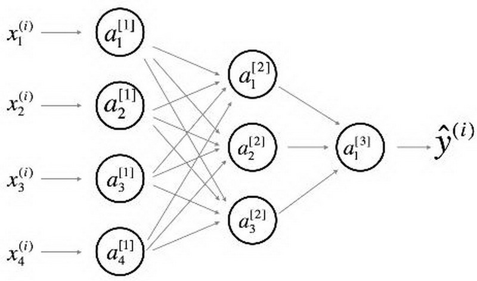
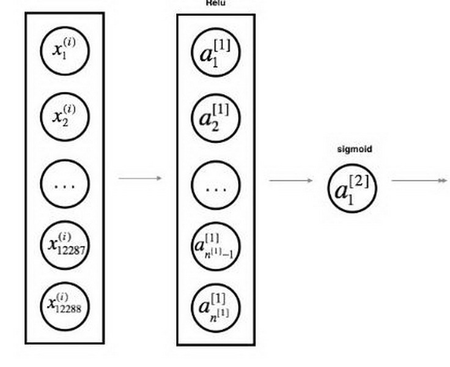

# 深度学习符号

_此笔记中使用的数学符号参考自《深度学习》和 Deep learning specialization_

## 常用的定义

* 原版符号定义中，$x^{(i)}$ 与 $x_i$ 存在混用的情况，请注意识别

### 数据标记与上下标

* 上标 $^{(i)}$ 代表第 $i$ 个训练样本
* 上标 $^{[l]}$ 代表第 $l$ 层
* $m$ 数据集的样本数
* 下标 $_x$ 输入数据
* 下标 $_y$ 输出数据
* $n_x$ 输入大小
* $n_y$ 输出大小 (或者类别数)
* $n_h^{[l]}$ 第 $l$ 层的隐藏单元数
* $L$ 神经网络的层数
* 在循环中
    * $n_x = n_h^{[0]}$
    * $n_y = n_h^{[L + 1]}$

### 神经网络模型

* $X \in \mathbb{R}^{n_x \times m}$ 代表输入的矩阵
* $x^{(i)} \in \mathbb{R}^{n_x}$ 代表第 $i$ 个样本的列向量
* $Y \in \mathbb{R}^{n_y \times m}$ 是标记矩阵
* $y^{(i)} \in \mathbb{R}^{n_y}$ 是第 $i$样本的输出标签
* $W^{[l]} \in \mathbb{R}^{l \times (l-1)}$ 代表第 $[l]$ 层的权重矩阵
* $b^{[l]} \in \mathbb{R}^{l}$ 代表第 $[l]$ 层的偏差矩阵
* $\hat{y} \in \mathbb{R}^{n_y}$ 是预测输出向量
    * 也可以用 $a^{[L]}$ 表示

#### 正向传播方程示例

* $a = g^{[l]}(W_x x^{(i)}_ + b_1) = g^{[l]}(z_1)$
    * 其中， $g^{[l]}$ 代表第 $l$ 层的激活函数
* $\hat{y} = softmax(W_h h + b_2)$

#### 通用激活公式

* $a_j^{[l]} = g^{[l]}(z_j^{[l]}) = g^{[l]}(\sum_k w_{jk}^{[l]}a_k^{[l-1]} + b_j^{[l]})$
    * $j$ 当前层的维度
    * $k$ 上一层的维度

#### 损失函数

* $J(x, W, b, y)$ 或者 $J(\hat{y}, y)$
* 常见损失函数示例
    * $J_{CE}(\hat{y}, y) = -\sum_{i=0}^m y^{(i)}log\hat{y}^{(i)}$
    * $J_1(\hat{y}, y) = -\sum_{i=0}^m |y^{(i)} - \hat{y}^{(i)}|$

## 深度学习图示

* 节点：代表输入、激活或者输出
* 边：代表权重或者误差

提供两种等效的示意图

### 详细的网络

常用于神经网络的表示,为了更好的审美，我们省略了一些在边上的参数的细节(如$w_{ij}^{[l]}$ 和$b_{i}^{[l]}$等)。

### 简化网络

两层神经网络的更简单的表示。

_****_
